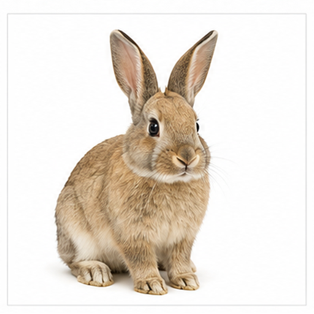
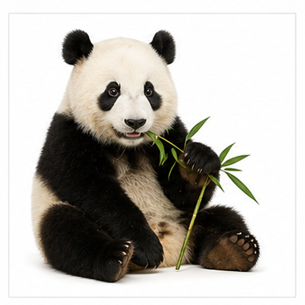
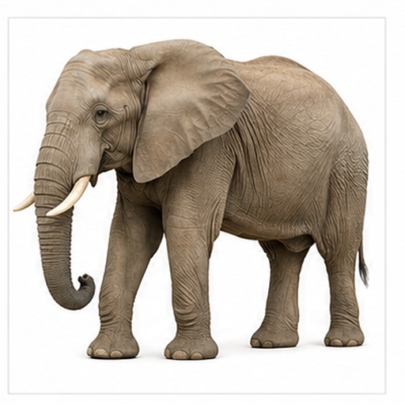
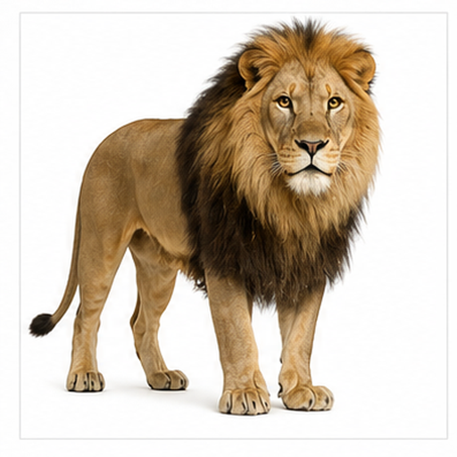
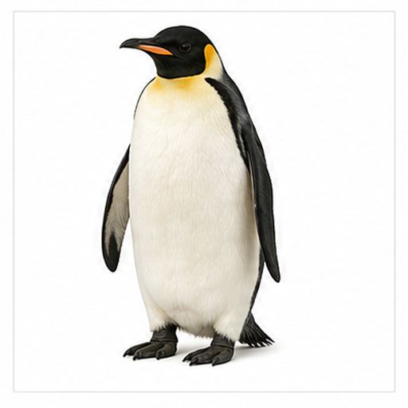
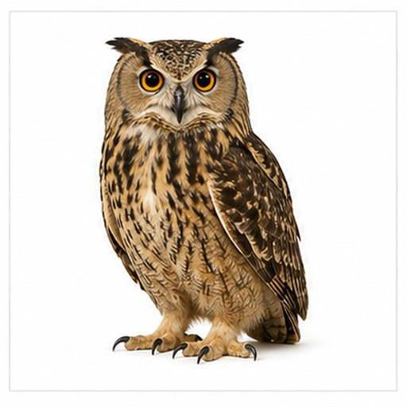
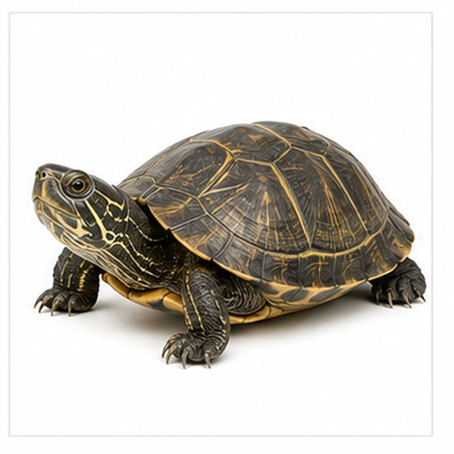

# 多动物图片召回评测

本文档用于评测多模态检索系统能否根据文本查询召回对应图片 asset，以及根据语义问题召回对应文本小节 chunk。

## 猫 / Cat

Target: animals.cat

猫是常见伴侣动物，行动敏捷，常与家庭生活场景相关。

三角耳、圆脸、胡须和明亮眼睛是猫图像中的关键线索。

适合测试宠物类别、脸部轮廓和胡须等细节召回。

检索提示：猫、Cat、多动物图片召回评测、图片、颜色、形状、局部特征、用途。

## 狗 / Dog

Target: animals.dog

狗是常见伴侣动物，也可承担看护、导盲和搜救等工作。

下垂耳、短吻部和亲近人类的表情构成主要视觉特征。

适合测试宠物动物、耳朵形状和英文 dog 查询召回。

检索提示：狗、Dog、多动物图片召回评测、图片、颜色、形状、局部特征、用途。

## 兔子 / Rabbit

Target: animals.rabbit

兔子以跳跃移动和草食性为人熟知，常见于农场和宠物场景。

长耳朵、浅色皮毛、小鼻子和圆润脸部是关键视觉线索。

适合测试长耳动物和浅色毛发的图片召回。

检索提示：兔子、Rabbit、多动物图片召回评测、图片、颜色、形状、局部特征、用途。

## 熊猫 / Panda

Target: animals.panda

熊猫是中国代表性动物，以竹子为主要食物来源。

黑白分明的毛色、黑眼圈和圆形耳朵非常突出。

适合测试高对比黑白动物和中文熊猫查询召回。

检索提示：熊猫、Panda、多动物图片召回评测、图片、颜色、形状、局部特征、用途。

## 大象 / Elephant

Target: animals.elephant

大象是大型陆生哺乳动物，具有复杂社会行为。

灰色体色、大耳朵、长鼻子和象牙是典型视觉特征。

适合测试大型动物、长鼻结构和灰色外观召回。

检索提示：大象、Elephant、多动物图片召回评测、图片、颜色、形状、局部特征、用途。

## 狮子 / Lion

Target: animals.lion

狮子是大型猫科动物，常被视为草原生态中的顶级捕食者。

雄狮浓密鬃毛、金棕色面部和强烈径向轮廓是视觉重点。

适合测试鬃毛纹理、金棕色和猛兽类别召回。

检索提示：狮子、Lion、多动物图片召回评测、图片、颜色、形状、局部特征、用途。

## 企鹅 / Penguin

Target: animals.penguin

企鹅是不会飞的鸟类，多生活在南半球寒冷或海洋环境。

黑白身体、橙色喙和直立姿态是典型图像线索。

适合测试鸟类、黑白身体和姿态召回。

检索提示：企鹅、Penguin、多动物图片召回评测、图片、颜色、形状、局部特征、用途。

## 猫头鹰 / Owl

Target: animals.owl

猫头鹰多在夜间活动，以敏锐听觉和视觉捕猎。

大眼睛、短喙、圆形头部和耳羽轮廓非常突出。

适合测试眼部区域、夜行鸟类和中文名称召回。

检索提示：猫头鹰、Owl、多动物图片召回评测、图片、颜色、形状、局部特征、用途。

## 狐狸 / Fox

Target: animals.fox

狐狸是机敏的小型犬科动物，常出现在森林和草地边缘。

橙红色毛发、尖耳和白色胸脸区域是主要视觉线索。

适合测试红棕色动物、尖耳和面部色块召回。

检索提示：狐狸、Fox、多动物图片召回评测、图片、颜色、形状、局部特征、用途。

## 乌龟 / Turtle

Target: animals.turtle

乌龟以硬壳和缓慢移动为特点，生活在陆地或水域附近。

绿色或棕色龟壳、伸出的头部和短足构成典型形象。

适合测试壳体纹理、爬行动物和局部结构召回。

检索提示：乌龟、Turtle、多动物图片召回评测、图片、颜色、形状、局部特征、用途。
