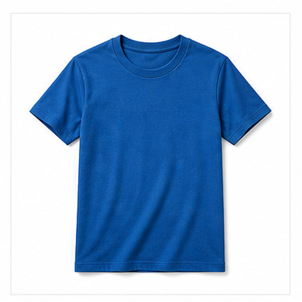
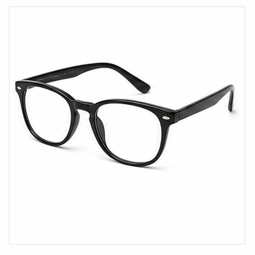
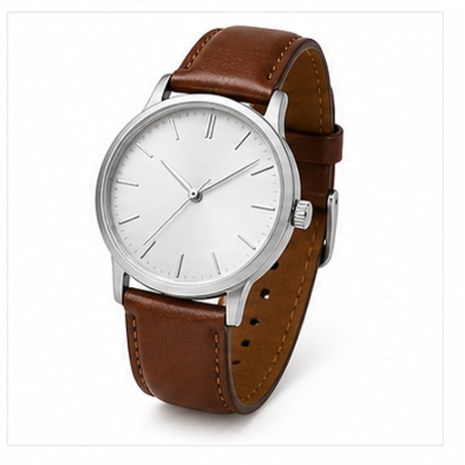
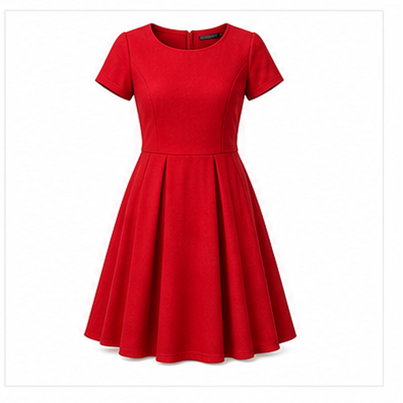

# 多服饰配件图片召回评测

本文档用于增补多模态召回评测的视觉域，覆盖更广泛的物体、材质、场景和用途。

## T 恤 / T-shirt

Target: clothing.t_shirt

T 恤是常见上衣，适合日常休闲穿着。

短袖、圆领和平整衣身是主要视觉线索。

适合测试基础服装和衣领袖口召回。

检索提示：T 恤、T-shirt、多服饰配件图片召回评测、图片、颜色、形状、材质、局部特征、用途。

## 夹克 / Jacket

Target: clothing.jacket

夹克用于保暖或防风，常作为外套穿着。

前襟、拉链、袖子和较厚面料是关键特征。

适合测试外套类服装和拉链结构召回。

检索提示：夹克、Jacket、多服饰配件图片召回评测、图片、颜色、形状、材质、局部特征、用途。

## 运动鞋 / Running Shoe

Target: clothing.running_shoe

运动鞋用于跑步、训练和日常运动穿着。

鞋面、鞋带、厚鞋底和流线轮廓是主要线索。

适合测试鞋类、鞋带和运动语义召回。

检索提示：运动鞋、Running Shoe、多服饰配件图片召回评测、图片、颜色、形状、材质、局部特征、用途。

## 帽子 / Hat

Target: clothing.hat

帽子用于遮阳、保暖或搭配服装。

帽檐、圆顶和可戴在头部的轮廓是典型特征。

适合测试头部配饰和帽檐召回。

检索提示：帽子、Hat、多服饰配件图片召回评测、图片、颜色、形状、材质、局部特征、用途。

## 背包 / Backpack

Target: clothing.backpack

背包用于携带书本、电脑和旅行用品。

双肩带、主仓、拉链和前袋是主要视觉线索。

适合测试包袋、肩带和收纳结构召回。

检索提示：背包、Backpack、多服饰配件图片召回评测、图片、颜色、形状、材质、局部特征、用途。

## 眼镜 / Eyeglasses

Target: clothing.eyeglasses

眼镜用于矫正视力、保护眼睛或装饰。

两个镜片、镜框和镜腿构成对称结构。

适合测试透明材质、细框和面部配件召回。

检索提示：眼镜、Eyeglasses、多服饰配件图片召回评测、图片、颜色、形状、材质、局部特征、用途。

## 手表 / Wristwatch

Target: clothing.wristwatch

手表用于查看时间，也可作为配饰。

表盘、指针或屏幕、表带构成腕戴结构。

适合测试小型配件和圆形表盘召回。

检索提示：手表、Wristwatch、多服饰配件图片召回评测、图片、颜色、形状、材质、局部特征、用途。

## 雨伞 / Umbrella

Target: clothing.umbrella

雨伞用于遮雨和遮阳，常可折叠携带。

弧形伞面、伞骨和手柄是主要视觉线索。

适合测试展开伞面和天气用品召回。

检索提示：雨伞、Umbrella、多服饰配件图片召回评测、图片、颜色、形状、材质、局部特征、用途。

## 连衣裙 / Dress

Target: clothing.dress

连衣裙是一体式服装，常用于日常或正式场合。

上身、裙摆和连续衣身轮廓是关键视觉特征。

适合测试女装、裙摆和整体服装轮廓召回。

检索提示：连衣裙、Dress、多服饰配件图片召回评测、图片、颜色、形状、材质、局部特征、用途。

## 围巾 / Scarf

Target: clothing.scarf

围巾用于保暖、装饰或搭配服装。

长条布料、柔软褶皱和可缠绕形态是主要线索。

适合测试织物材质和长条配饰召回。

检索提示：围巾、Scarf、多服饰配件图片召回评测、图片、颜色、形状、材质、局部特征、用途。
