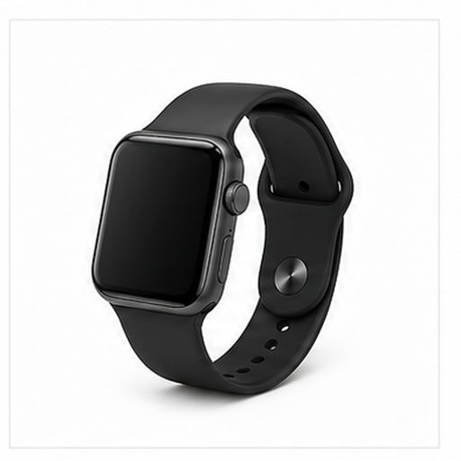
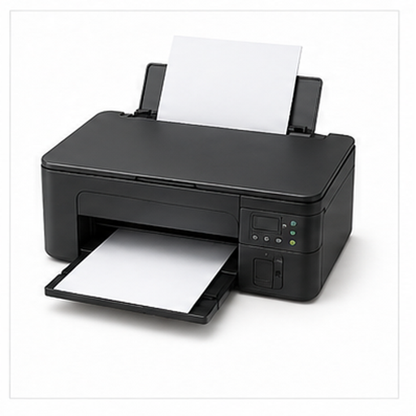

# 多电子设备图片召回评测

本文档用于增补多模态召回评测的视觉域，覆盖更广泛的物体、材质、场景和用途。

## 手机 / Smartphone

Target: electronics.smartphone

手机是便携式电子设备，用于通信、拍摄和移动应用。

矩形屏幕、黑色边框和小型机身是主要视觉线索。

适合测试屏幕类设备和便携电子产品召回。

检索提示：手机、Smartphone、多电子设备图片召回评测、图片、颜色、形状、材质、局部特征、用途。

## 笔记本电脑 / Laptop

Target: electronics.laptop

笔记本电脑用于办公、学习和移动计算。

展开的屏幕、键盘和铰链结构是关键视觉特征。

适合测试电脑设备、键盘和屏幕组合召回。

检索提示：笔记本电脑、Laptop、多电子设备图片召回评测、图片、颜色、形状、材质、局部特征、用途。

## 相机 / Camera

Target: electronics.camera

相机用于拍摄照片和视频，是常见影像设备。

镜头、机身和取景区域构成核心视觉线索。

适合测试圆形镜头和影像设备召回。

检索提示：相机、Camera、多电子设备图片召回评测、图片、颜色、形状、材质、局部特征、用途。

## 耳机 / Headphones

Target: electronics.headphones

耳机用于收听音频，可覆盖双耳或连接移动设备。

头梁、左右耳罩和弧形轮廓是主要视觉特征。

适合测试音频设备和对称耳罩结构召回。

检索提示：耳机、Headphones、多电子设备图片召回评测、图片、颜色、形状、材质、局部特征、用途。

## 智能手表 / Smartwatch

Target: electronics.smartwatch

智能手表可显示通知、健康数据和运动信息。

小型方形或圆形屏幕与表带组合明显。

适合测试腕戴设备、屏幕和表带召回。

检索提示：智能手表、Smartwatch、多电子设备图片召回评测、图片、颜色、形状、材质、局部特征、用途。

## 路由器 / Router

Target: electronics.router

路由器用于家庭或办公室网络连接。

扁平机身、天线和指示灯区域是典型线索。

适合测试网络设备和天线结构召回。

检索提示：路由器、Router、多电子设备图片召回评测、图片、颜色、形状、材质、局部特征、用途。

## 打印机 / Printer

Target: electronics.printer

打印机用于输出纸质文档或图像。

方正机身、出纸口和托盘结构是主要视觉线索。

适合测试办公电子设备和出纸结构召回。

检索提示：打印机、Printer、多电子设备图片召回评测、图片、颜色、形状、材质、局部特征、用途。

## 无人机 / Drone

Target: electronics.drone

无人机可用于航拍、巡检和娱乐飞行。

四个旋翼、机身和对称臂架是关键视觉特征。

适合测试飞行设备和多旋翼结构召回。

检索提示：无人机、Drone、多电子设备图片召回评测、图片、颜色、形状、材质、局部特征、用途。

## 游戏手柄 / Game Controller

Target: electronics.game_controller

游戏手柄用于控制电子游戏角色和菜单。

双握柄、按钮、摇杆和方向键构成典型外观。

适合测试娱乐电子设备和按钮布局召回。

检索提示：游戏手柄、Game Controller、多电子设备图片召回评测、图片、颜色、形状、材质、局部特征、用途。

## 麦克风 / Microphone

Target: electronics.microphone

麦克风用于录音、直播和语音输入。

圆柱形握柄、网格拾音头和支架结构是主要线索。

适合测试音频输入设备和网格纹理召回。

检索提示：麦克风、Microphone、多电子设备图片召回评测、图片、颜色、形状、材质、局部特征、用途。
