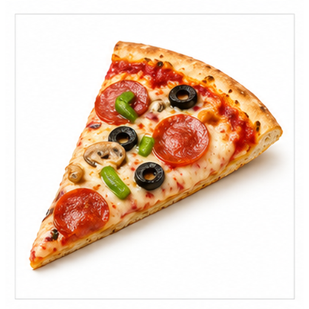
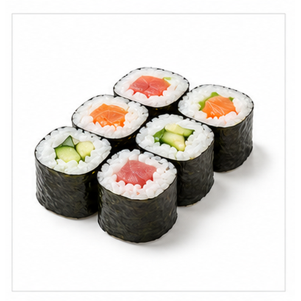
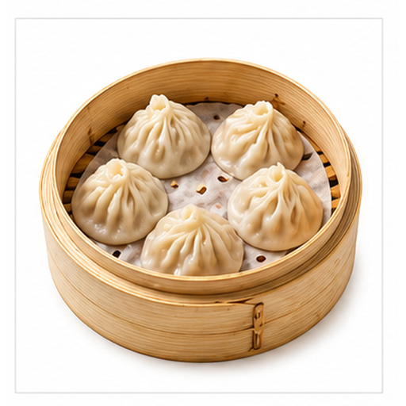
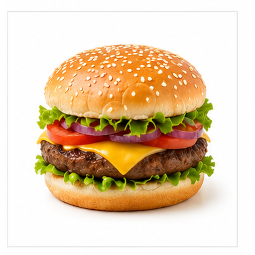
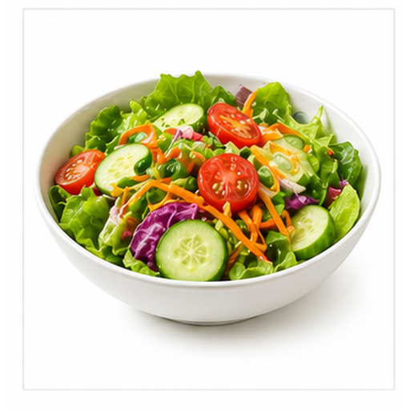
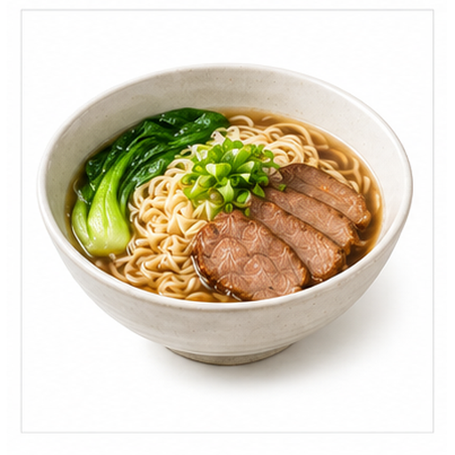
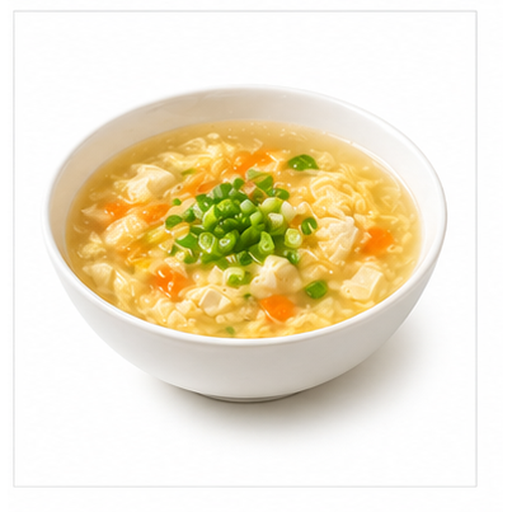

# 多食物图片召回评测

本文档用于评测多模态检索系统能否根据文本查询召回对应图片 asset，以及根据语义问题召回对应文本小节 chunk。

## 面包 / Bread

Target: foods.bread

面包由面粉烘焙而成，可作为早餐或主食。

金棕色外皮、柔软内部和圆润烘焙轮廓是主要线索。

适合测试烘焙食品、棕色外皮和英文 bread 查询召回。

检索提示：面包、Bread、多食物图片召回评测、图片、颜色、形状、局部特征、用途。

## 披萨 / Pizza

Target: foods.pizza

披萨由面饼、酱料、奶酪和配料烘烤而成。

三角形切片、红色酱料、黄色奶酪和圆形配料是关键视觉线索。

适合测试西式食物、三角切片和配料召回。

检索提示：披萨、Pizza、多食物图片召回评测、图片、颜色、形状、局部特征、用途。

## 寿司 / Sushi

Target: foods.sushi

寿司由米饭、海苔和鱼肉或蔬菜等馅料组合而成。

黑色海苔外圈、白色米饭和中心彩色馅料构成典型切面。

适合测试日式食物、圆柱切面和英文 sushi 查询召回。

检索提示：寿司、Sushi、多食物图片召回评测、图片、颜色、形状、局部特征、用途。

## 饺子 / Dumpling

Target: foods.dumpling

饺子是常见中式食物，由面皮包裹馅料制成。

半月形轮廓、浅色面皮和褶边是主要视觉线索。

适合测试中式食物、褶边和中文饺子查询召回。

检索提示：饺子、Dumpling、多食物图片召回评测、图片、颜色、形状、局部特征、用途。

## 汉堡 / Burger

Target: foods.burger

汉堡由面包、肉饼、蔬菜和奶酪等食材层叠组成。

上下圆面包、多层夹馅和横向分层结构非常明显。

适合测试分层食物、肉饼和英文 burger 查询召回。

检索提示：汉堡、Burger、多食物图片召回评测、图片、颜色、形状、局部特征、用途。

## 沙拉 / Salad

Target: foods.salad

沙拉通常由蔬菜、水果或蛋白质食材混合而成。

绿色叶菜、彩色配料和碗状容器是典型视觉线索。

适合测试绿色蔬菜、碗中食物和健康食品召回。

检索提示：沙拉、Salad、多食物图片召回评测、图片、颜色、形状、局部特征、用途。

## 面条 / Noodles

Target: foods.noodles

面条是长条状主食，可搭配汤底、酱料或配菜。

碗中弯曲长条、浅黄色面体和筷子或汤面结构是主要线索。

适合测试碗装主食和长条形食物召回。

检索提示：面条、Noodles、多食物图片召回评测、图片、颜色、形状、局部特征、用途。

## 蛋糕 / Cake

Target: foods.cake

蛋糕是甜点，常用于生日、庆祝和下午茶场景。

奶油层、粉色或浅色糕体和蜡烛是关键视觉线索。

适合测试甜点、蜡烛和庆祝语义召回。

检索提示：蛋糕、Cake、多食物图片召回评测、图片、颜色、形状、局部特征、用途。

## 米饭 / Rice

Target: foods.rice

米饭由稻米蒸煮而成，是许多地区的主食。

白色米粒聚集在碗中，形态细小且整体颜色均匀。

适合测试白色主食、碗装食物和中文米饭查询召回。

检索提示：米饭、Rice、多食物图片召回评测、图片、颜色、形状、局部特征、用途。

## 汤 / Soup

Target: foods.soup

汤由液体和配料组成，可作为正餐、前菜或补充水分的食物。

碗中液体表面、彩色配料和圆形容器是主要视觉线索。

适合测试液体食物、碗和配料召回。

检索提示：汤、Soup、多食物图片召回评测、图片、颜色、形状、局部特征、用途。
