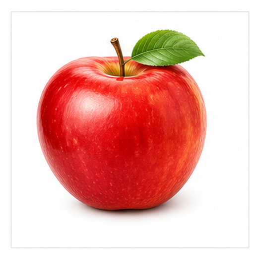
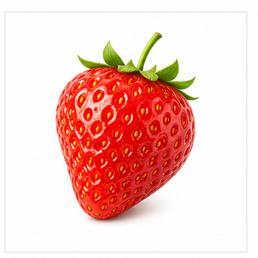
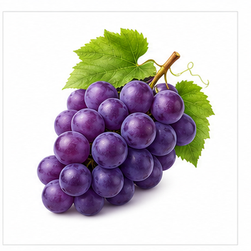
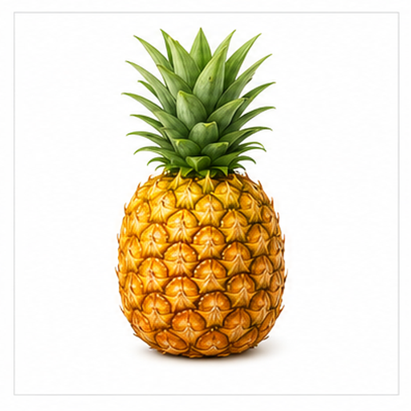
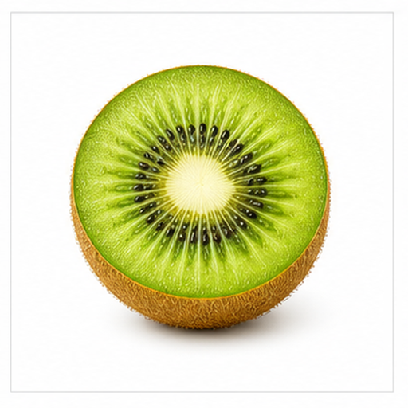

# 多水果图片召回评测

本文档用于评测多模态检索系统能否根据文本查询召回对应图片 asset，以及根据语义问题召回对应文本小节 chunk。

## 苹果 / Apple

Target: fruits.apple

苹果是常见水果，通常用于鲜食、烘焙和果汁制作。

红色圆形果身、短果梗和绿色叶片是图片中的主要视觉线索。

适合测试红色圆形水果、叶片、果梗和中英文水果名称的跨模态召回。

检索提示：苹果、Apple、多水果图片召回评测、图片、颜色、形状、局部特征、用途。

## 香蕉 / Banana

Target: fruits.banana

香蕉是热带水果，成熟时口感柔软并带有明显甜味。

弯曲的长条形轮廓、黄色表皮和两端深色蒂部是关键视觉线索。

适合测试弯月形、黄色水果和英文 banana 查询的图片召回。

检索提示：香蕉、Banana、多水果图片召回评测、图片、颜色、形状、局部特征、用途。

## 橙子 / Orange

Target: fruits.orange

橙子富含汁液，常用于鲜食、榨汁和甜点调味。

明亮橙色外皮、近圆形轮廓和表皮纹理是主要视觉特征。

适合测试橙色圆形目标以及与柠檬等相近颜色目标的区分。

检索提示：橙子、Orange、多水果图片召回评测、图片、颜色、形状、局部特征、用途。

## 草莓 / Strawberry

Target: fruits.strawberry

草莓是浆果类水果，常用于甜点、果酱和鲜食。

红色心形或圆锥形果身、浅色籽点和绿色萼片构成强视觉组合。

适合测试红色小籽、绿色顶部结构和局部纹理召回。

检索提示：草莓、Strawberry、多水果图片召回评测、图片、颜色、形状、局部特征、用途。

## 葡萄 / Grape

Target: fruits.grape

葡萄通常成串生长，可鲜食，也可用于酿酒和制作葡萄干。

紫色小圆果聚集成串，并带有绿色叶片或藤梗。

适合测试数量聚类、紫色果粒和成串结构的多模态召回。

检索提示：葡萄、Grape、多水果图片召回评测、图片、颜色、形状、局部特征、用途。

## 西瓜 / Watermelon

Target: fruits.watermelon

西瓜是夏季常见水果，果肉多汁，常切片食用。

绿色瓜皮、浅色内层、红色果肉和黑色籽粒是显著线索。

适合测试切片结构、红绿颜色对比和籽粒细节召回。

检索提示：西瓜、Watermelon、多水果图片召回评测、图片、颜色、形状、局部特征、用途。

## 菠萝 / Pineapple

Target: fruits.pineapple

菠萝有浓郁香气，常用于鲜食、果汁和烹饪。

金黄色椭圆果身、菱格纹理和绿色冠叶组合明显。

适合测试纹理、冠叶和黄绿色组合的图片召回。

检索提示：菠萝、Pineapple、多水果图片召回评测、图片、颜色、形状、局部特征、用途。

## 猕猴桃 / Kiwi

Target: fruits.kiwi

猕猴桃常以切面展示，口感酸甜，富含维生素。

棕色外皮、绿色果肉、白色中心和环形黑籽构成典型切面。

适合测试切面、环形籽粒和绿色果肉的细粒度召回。

检索提示：猕猴桃、Kiwi、多水果图片召回评测、图片、颜色、形状、局部特征、用途。

## 芒果 / Mango

Target: fruits.mango

芒果是热带水果，常用于鲜食、果汁和甜品。

椭圆果形、黄橙色主体和局部红绿色渐变是主要视觉特征。

适合测试渐变色、椭圆形和热带水果语义召回。

检索提示：芒果、Mango、多水果图片召回评测、图片、颜色、形状、局部特征、用途。

## 柠檬 / Lemon

Target: fruits.lemon

柠檬常用于调味、饮品和烘焙，味道酸爽。

亮黄色椭圆形果身和两端略尖的轮廓有助于区分橙子。

适合测试相近颜色但形状不同的水果识别。

检索提示：柠檬、Lemon、多水果图片召回评测、图片、颜色、形状、局部特征、用途。
