# 多图功能组合评测

本文档用于评测一个文本小节同时关联多张图片 asset 的多模态召回能力。

## 急救用品组合 / First Aid Set

Target: groups.first_aid_set

这一组表达家庭或现场急救中的常见物品组合。

急救箱用于集中收纳，绷带用于包扎，体温计用于测温，口罩用于基础防护，四者共同构成应急医疗场景。

## 办公桌文具组合 / Office Desk Set

Target: groups.office_desk_set

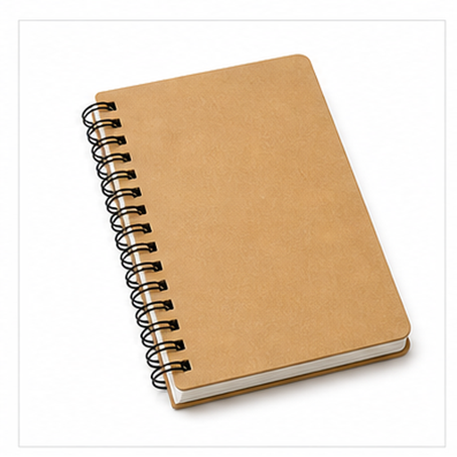

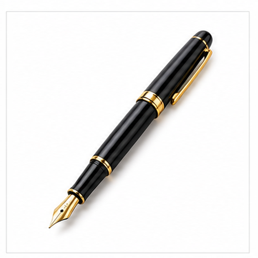

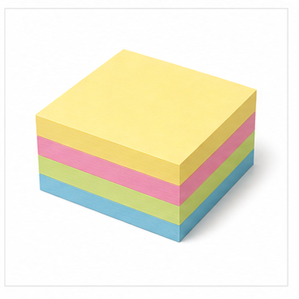

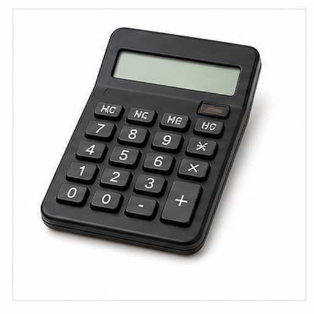

这一组表达办公桌上的记录、提醒和计算工具。

笔记本承载长文本记录，钢笔用于书写，便签记录短提醒，计算器处理数字统计，组合语义指向办公任务。

## 厨房电器组合 / Kitchen Appliance Set

Target: groups.kitchen_appliance_set

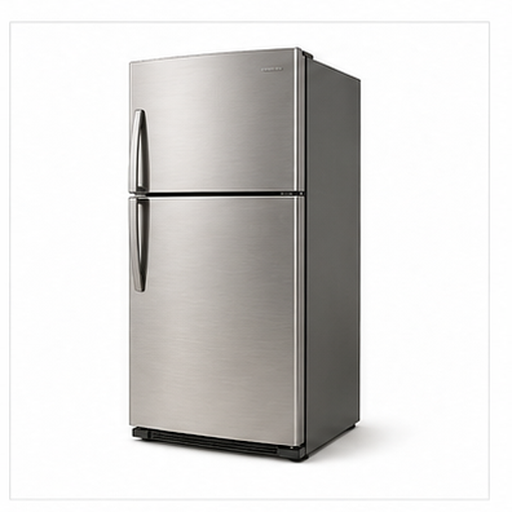

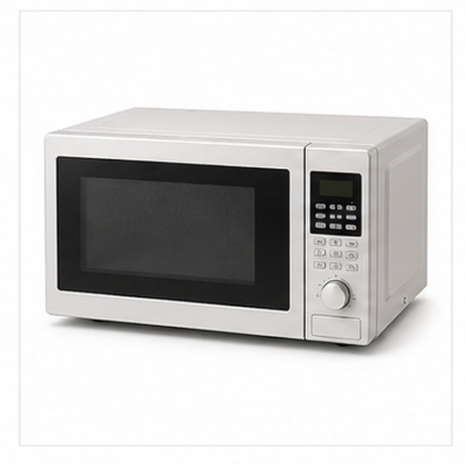

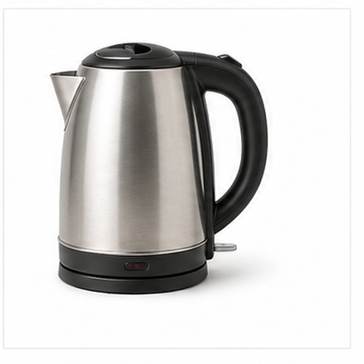

这一组表达厨房中保存、加热和烧水的电器组合。

冰箱用于低温保存，微波炉用于快速加热，电水壶用于烧水，三者覆盖厨房常见食物处理流程。

## 健身训练组合 / Workout Training Set

Target: groups.workout_training_set

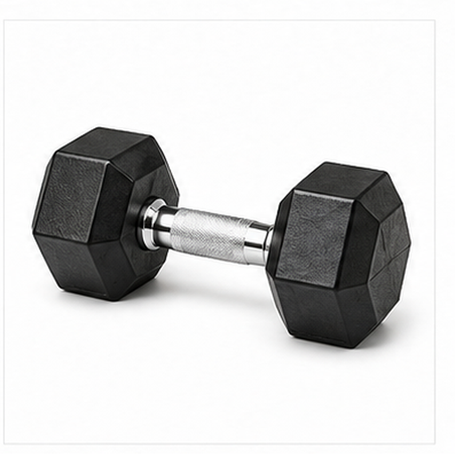

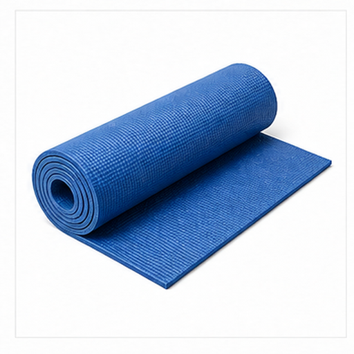

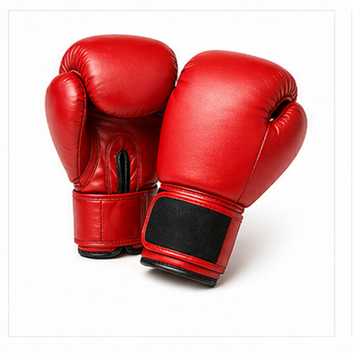

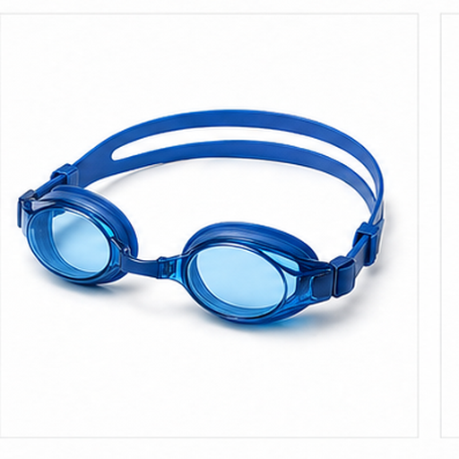

这一组表达不同运动训练方式的器材组合。

哑铃用于力量训练，瑜伽垫用于拉伸和地面训练，拳击手套用于击打保护，游泳镜用于水中视野保护。

## 录音直播设备组合 / Recording and Streaming Set

Target: groups.recording_streaming_set

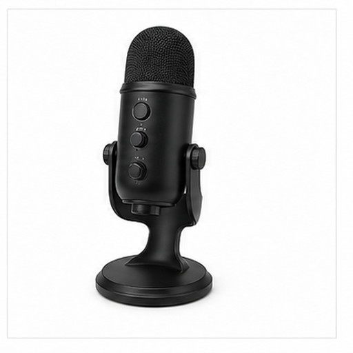

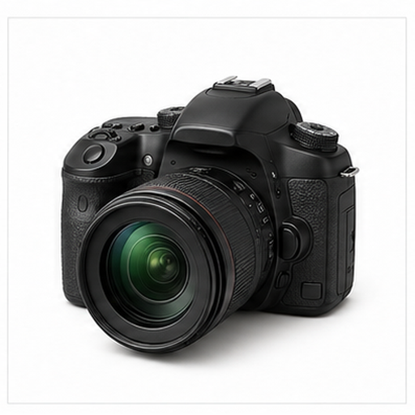

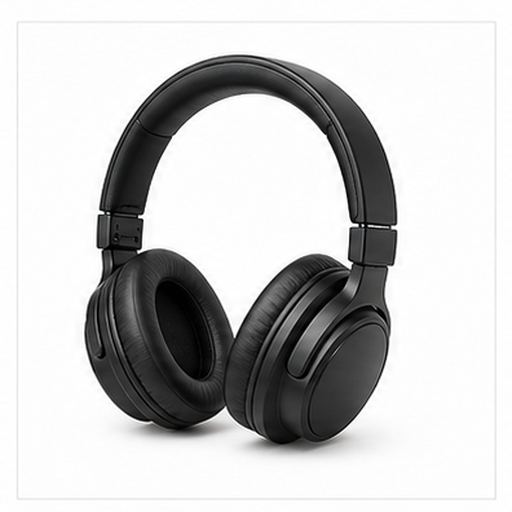

这一组表达录音、拍摄和监听的创作设备组合。

麦克风负责语音输入，相机负责影像采集，耳机用于监听音频，三者共同构成直播或录制工作流。

## 出行携带组合 / Travel Carry Set

Target: groups.travel_carry_set

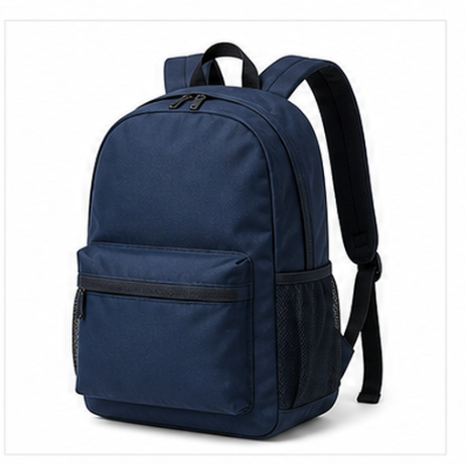

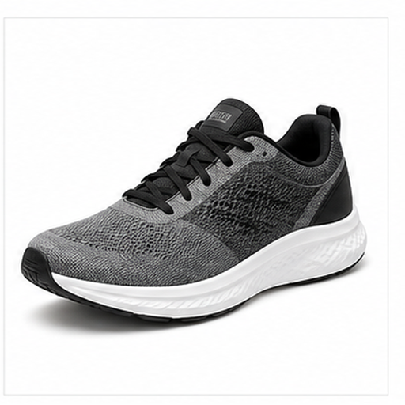

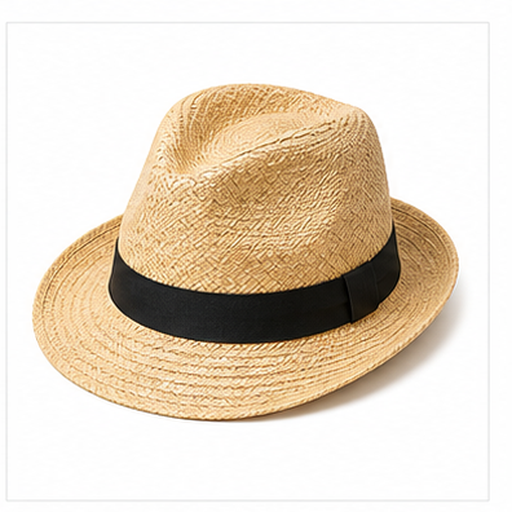

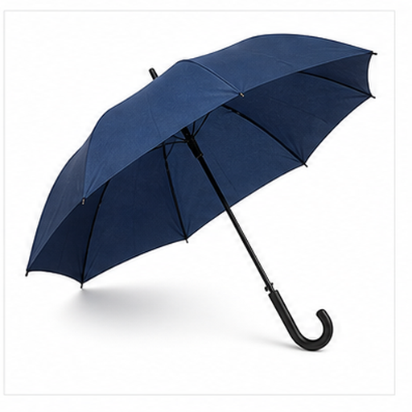

这一组表达日常出行中收纳、步行和天气防护。

背包用于携带物品，运动鞋适合步行，帽子可遮阳，雨伞应对降雨或强光，组合语义指向户外出行。

## 家庭清洁组合 / Home Cleaning Set

Target: groups.home_cleaning_set

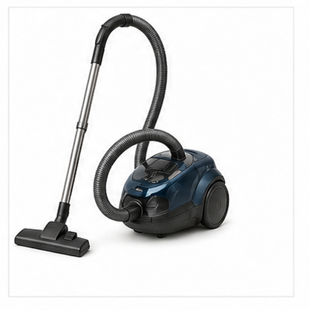

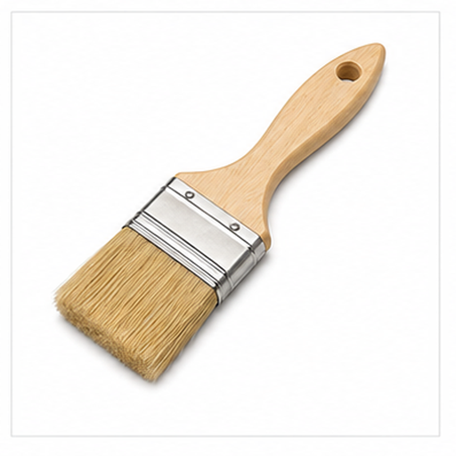

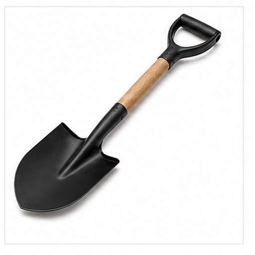

这一组表达家庭或庭院清洁中的工具组合。

吸尘器清理地面和缝隙，刷子用于涂刷或表面清理，铲子可搬运或清理材料，三者覆盖不同清洁尺度。

## 乐队演奏组合 / Music Band Set

Target: groups.music_band_set

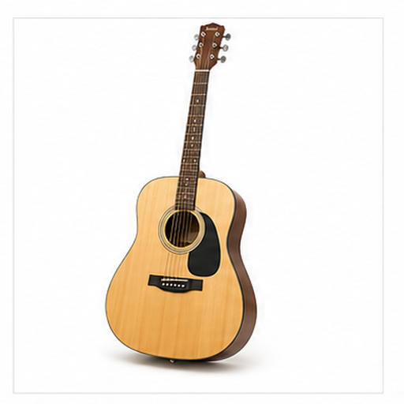

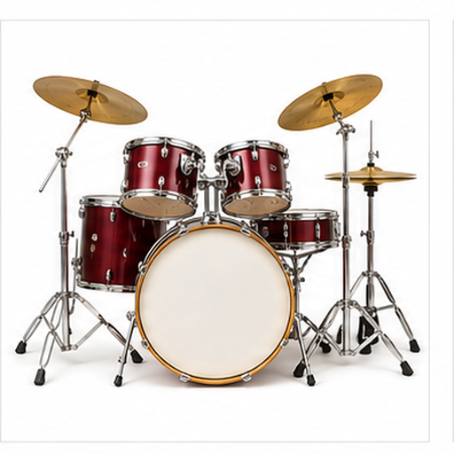

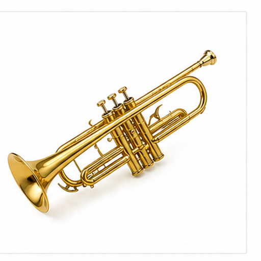

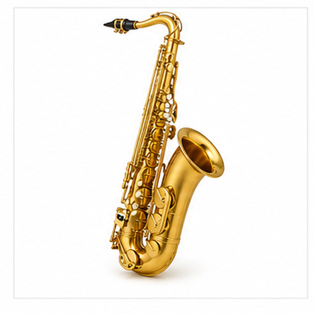

这一组表达小型乐队的弦乐、节奏和管乐组合。

吉他提供和声与旋律，架子鼓负责节奏，小号和萨克斯提供铜管或簧片音色，适合测试多乐器语义聚合。

## 维修工具组合 / Repair Tool Set

Target: groups.repair_tool_set

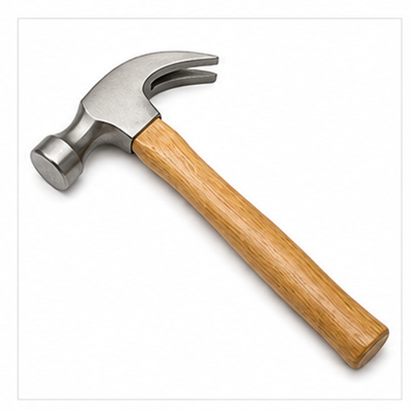

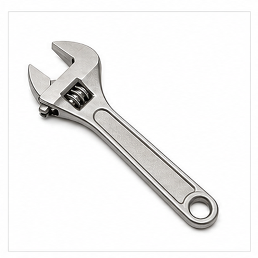

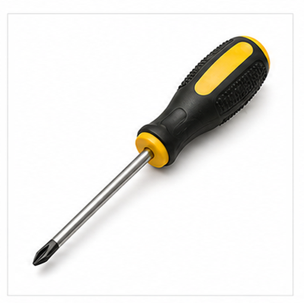

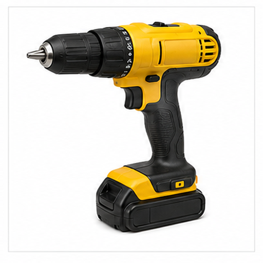

这一组表达装配和维修中常见的工具组合。

锤子用于敲击，扳手拧动螺母，螺丝刀处理螺丝，电钻用于钻孔或安装，四者共同对应维修任务。

## 早餐食物组合 / Breakfast Food Set

Target: groups.breakfast_food_set

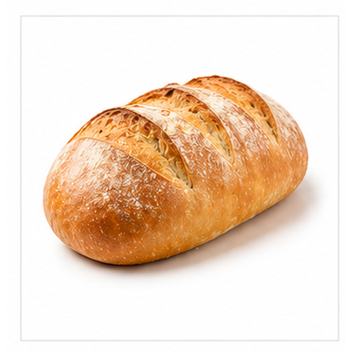

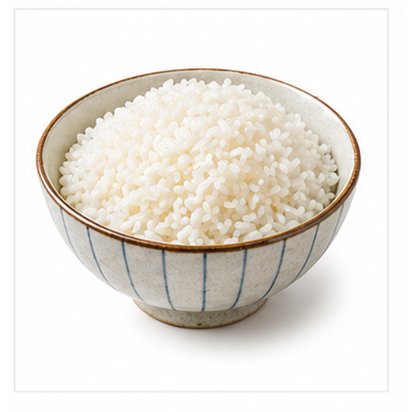

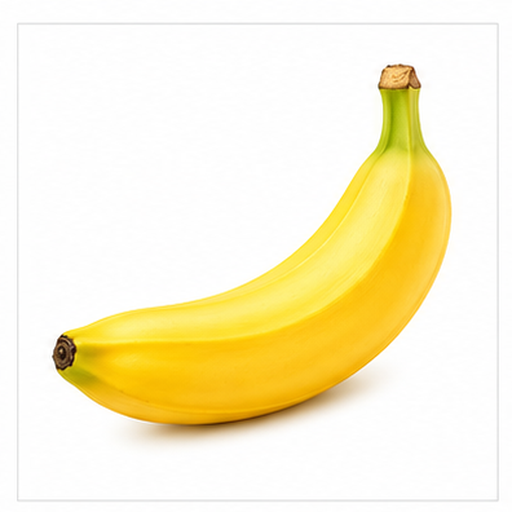

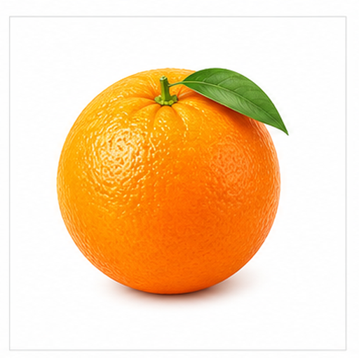

这一组表达早餐或轻食中的主食与水果组合。

面包和米饭提供主食语义，香蕉和橙子提供水果语义，组合中既有碳水主食也有鲜食水果。
