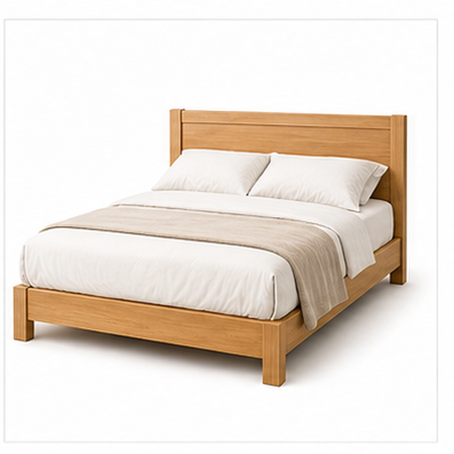
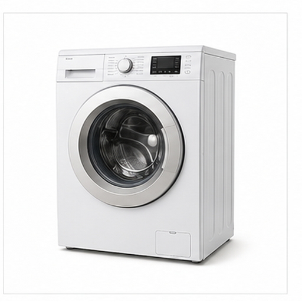
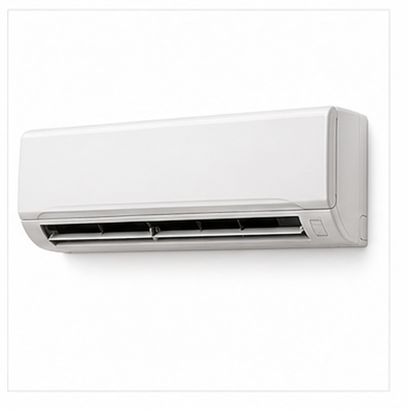
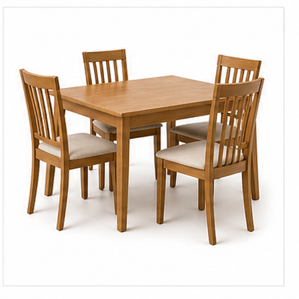

# 多家居用品图片召回评测

本文档用于增补多模态召回评测的视觉域，覆盖更广泛的物体、材质、场景和用途。

## 沙发 / Sofa

Target: household.sofa

沙发是客厅中常见的坐具，供休息和会客使用。

宽坐垫、靠背和扶手构成柔软家具轮廓。

适合测试家居家具和软质材质召回。

检索提示：沙发、Sofa、多家居用品图片召回评测、图片、颜色、形状、材质、局部特征、用途。

## 台灯 / Table Lamp

Target: household.table_lamp

台灯用于桌面照明，常见于书桌和床头柜。

灯罩、灯杆和底座形成上下结构。

适合测试照明用品和灯罩形态召回。

检索提示：台灯、Table Lamp、多家居用品图片召回评测、图片、颜色、形状、材质、局部特征、用途。

## 床 / Bed

Target: household.bed

床用于睡眠和休息，是卧室核心家具。

床垫、枕头、床头板和长方形轮廓是主要线索。

适合测试卧室家具和软装结构召回。

检索提示：床、Bed、多家居用品图片召回评测、图片、颜色、形状、材质、局部特征、用途。

## 冰箱 / Refrigerator

Target: household.refrigerator

冰箱用于低温保存食物和饮料。

高大柜体、门把手和冷藏门轮廓是关键特征。

适合测试厨房电器和竖直柜体召回。

检索提示：冰箱、Refrigerator、多家居用品图片召回评测、图片、颜色、形状、材质、局部特征、用途。

## 洗衣机 / Washing Machine

Target: household.washing_machine

洗衣机用于清洗衣物，是常见家用电器。

圆形舱门、方形机身和控制面板是主要线索。

适合测试家电和圆形门结构召回。

检索提示：洗衣机、Washing Machine、多家居用品图片召回评测、图片、颜色、形状、材质、局部特征、用途。

## 微波炉 / Microwave Oven

Target: household.microwave

微波炉用于快速加热食物。

矩形箱体、透明门窗和侧边控制面板是典型外观。

适合测试厨房小家电和门窗结构召回。

检索提示：微波炉、Microwave Oven、多家居用品图片召回评测、图片、颜色、形状、材质、局部特征、用途。

## 吸尘器 / Vacuum Cleaner

Target: household.vacuum_cleaner

吸尘器用于清洁地面和家具缝隙。

长管、吸头和机身组合形成清洁工具外观。

适合测试家居清洁设备和长管结构召回。

检索提示：吸尘器、Vacuum Cleaner、多家居用品图片召回评测、图片、颜色、形状、材质、局部特征、用途。

## 电水壶 / Electric Kettle

Target: household.electric_kettle

电水壶用于快速烧水，常见于厨房和办公室。

壶嘴、把手、壶身和底座是主要视觉线索。

适合测试小家电、壶形轮廓和把手召回。

检索提示：电水壶、Electric Kettle、多家居用品图片召回评测、图片、颜色、形状、材质、局部特征、用途。

## 空调 / Air Conditioner

Target: household.air_conditioner

空调用于调节室内温度和空气流动。

长条形室内机、出风口和简洁面板是关键特征。

适合测试白色家电和长条出风口召回。

检索提示：空调、Air Conditioner、多家居用品图片召回评测、图片、颜色、形状、材质、局部特征、用途。

## 餐桌 / Dining Table

Target: household.dining_table

餐桌用于进餐、摆放餐具和家庭聚会。

桌面、桌腿和围绕空间构成家具识别线索。

适合测试桌类家具和用餐场景语义召回。

检索提示：餐桌、Dining Table、多家居用品图片召回评测、图片、颜色、形状、材质、局部特征、用途。
