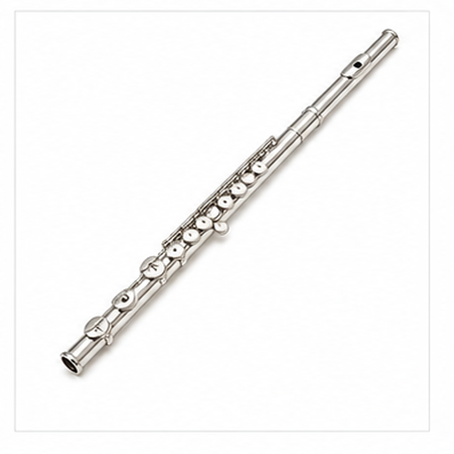
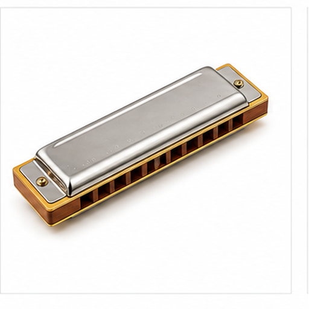
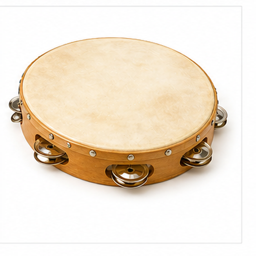

# 多乐器图片召回评测

本文档用于增补多模态召回评测的视觉域，覆盖更广泛的物体、材质、场景和用途。

## 钢琴 / Piano Keyboard

Target: instruments.piano

钢琴通过键盘敲击琴槌发声，常用于独奏和伴奏。

黑白琴键、长条键盘和光滑外壳是主要线索。

适合测试键盘乐器和黑白重复结构召回。

检索提示：钢琴、Piano Keyboard、多乐器图片召回评测、图片、颜色、形状、材质、局部特征、用途。

## 吉他 / Acoustic Guitar

Target: instruments.guitar

吉他通过拨弦或扫弦演奏，常用于流行和民谣音乐。

木质共鸣箱、圆形音孔、琴颈和弦是关键特征。

适合测试弦乐器、木纹和音孔召回。

检索提示：吉他、Acoustic Guitar、多乐器图片召回评测、图片、颜色、形状、材质、局部特征、用途。

## 小提琴 / Violin

Target: instruments.violin

小提琴是高音乐器，常用于独奏和管弦乐。

小型木质琴身、琴弓、弦和弯曲腰线是主要线索。

适合测试弓弦乐器和木质曲线结构召回。

检索提示：小提琴、Violin、多乐器图片召回评测、图片、颜色、形状、材质、局部特征、用途。

## 架子鼓 / Drum Kit

Target: instruments.drum_kit

架子鼓由多个鼓和镲片组成，用于节奏演奏。

圆形鼓面、支架和金属镲片组合明显。

适合测试多部件乐器和圆形鼓面召回。

检索提示：架子鼓、Drum Kit、多乐器图片召回评测、图片、颜色、形状、材质、局部特征、用途。

## 小号 / Trumpet

Target: instruments.trumpet

小号是铜管乐器，通过吹嘴和活塞演奏。

金属管身、喇叭口和三个活塞是主要视觉线索。

适合测试铜管乐器和金色金属材质召回。

检索提示：小号、Trumpet、多乐器图片召回评测、图片、颜色、形状、材质、局部特征、用途。

## 萨克斯 / Saxophone

Target: instruments.saxophone

萨克斯是簧片管乐器，常用于爵士乐和流行音乐。

弯曲金属管、按键和大喇叭口是关键特征。

适合测试弯曲管乐器和金属按键召回。

检索提示：萨克斯、Saxophone、多乐器图片召回评测、图片、颜色、形状、材质、局部特征、用途。

## 长笛 / Flute

Target: instruments.flute

长笛是横吹木管乐器，音色清亮。

细长金属管身和一排按键孔是主要线索。

适合测试细长乐器和线性按键召回。

检索提示：长笛、Flute、多乐器图片召回评测、图片、颜色、形状、材质、局部特征、用途。

## 大提琴 / Cello

Target: instruments.cello

大提琴是低音乐器，通常坐姿演奏。

大型木质琴身、长琴颈、弦和尾针是典型外观。

适合测试大型弦乐器和竖直形态召回。

检索提示：大提琴、Cello、多乐器图片召回评测、图片、颜色、形状、材质、局部特征、用途。

## 口琴 / Harmonica

Target: instruments.harmonica

口琴是小型吹奏乐器，便于携带。

长方形金属外壳和成排音孔是关键视觉线索。

适合测试小型乐器和重复孔洞结构召回。

检索提示：口琴、Harmonica、多乐器图片召回评测、图片、颜色、形状、材质、局部特征、用途。

## 手鼓 / Tambourine

Target: instruments.tambourine

手鼓通过摇动或拍击发声，常用于节奏伴奏。

圆形框架、鼓面和周围金属小镲片是主要特征。

适合测试打击乐器和圆形框架召回。

检索提示：手鼓、Tambourine、多乐器图片召回评测、图片、颜色、形状、材质、局部特征、用途。
