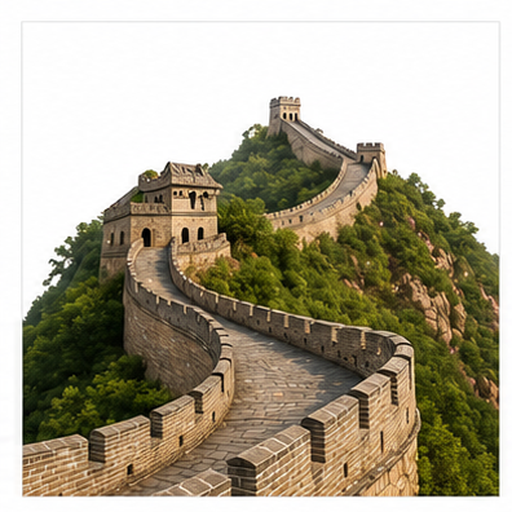
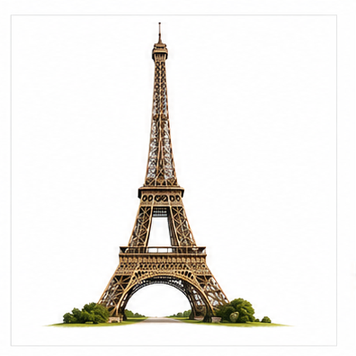
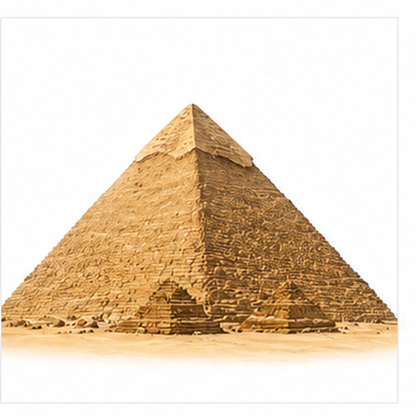
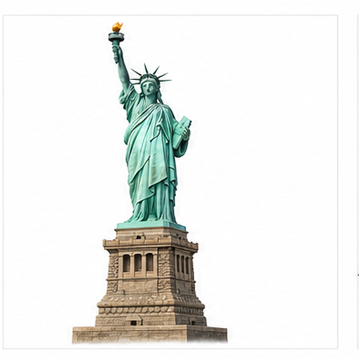
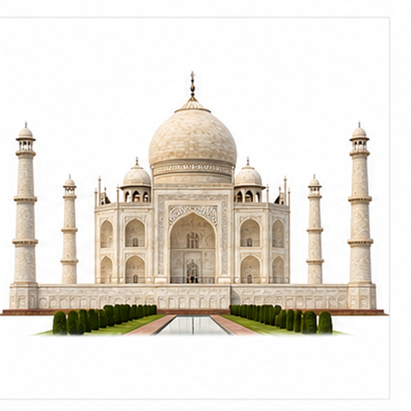
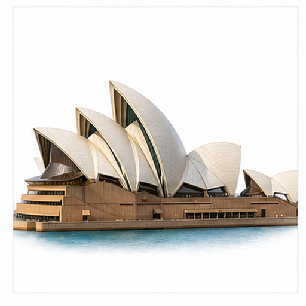
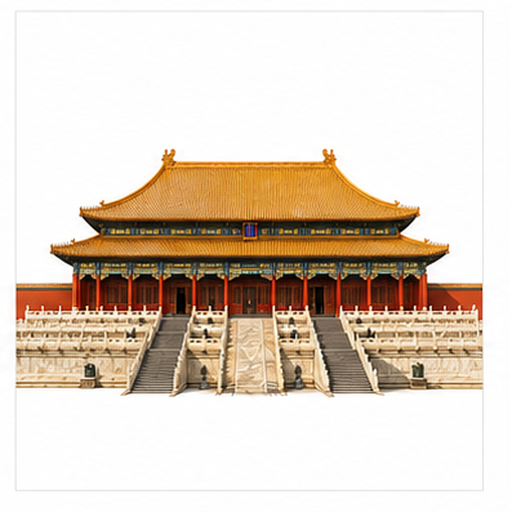
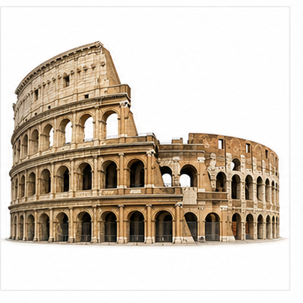
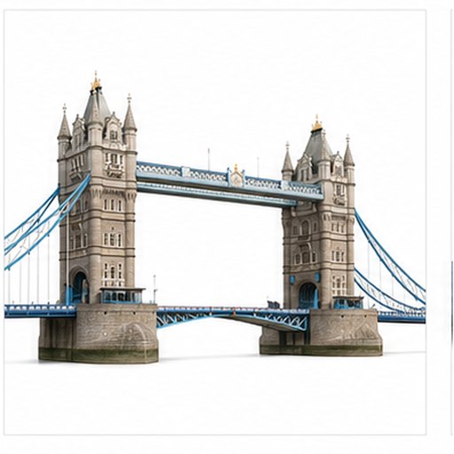
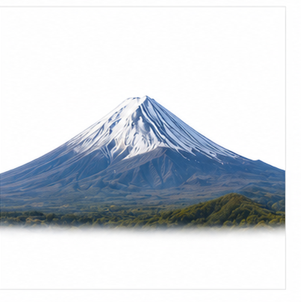

# 多地标图片召回评测

本文档用于评测多模态检索系统能否根据文本查询召回对应图片 asset，以及根据语义问题召回对应文本小节 chunk。

## 长城 / Great Wall

Target: landmarks.great_wall

长城是中国古代防御工程，沿山脊和地形延伸。

连续城墙、垛口和蜿蜒走势是最明显的视觉线索。

适合测试中国地标、城墙结构和英文 Great Wall 查询召回。

检索提示：长城、Great Wall、多地标图片召回评测、图片、颜色、形状、局部特征、用途。

## 埃菲尔铁塔 / Eiffel Tower

Target: landmarks.eiffel_tower

埃菲尔铁塔是法国巴黎代表性建筑，由金属结构组成。

高耸塔身、金属桁架和宽阔塔脚构成标志性轮廓。

适合测试欧洲地标、铁塔结构和英文 Eiffel Tower 查询召回。

检索提示：埃菲尔铁塔、Eiffel Tower、多地标图片召回评测、图片、颜色、形状、局部特征、用途。

## 金字塔 / Pyramid

Target: landmarks.pyramid

埃及金字塔是古代大型陵墓建筑，以几何外形著称。

沙色石材、巨大三角形侧面和尖顶是主要视觉线索。

适合测试古代建筑、三角形轮廓和沙漠色彩召回。

检索提示：金字塔、Pyramid、多地标图片召回评测、图片、颜色、形状、局部特征、用途。

## 自由女神像 / Statue of Liberty

Target: landmarks.statue_of_liberty

自由女神像是美国纽约港的标志性雕像。

绿色铜像、冠冕和高举火炬的姿态非常突出。

适合测试雕像、火炬和美国地标语义召回。

检索提示：自由女神像、Statue of Liberty、多地标图片召回评测、图片、颜色、形状、局部特征、用途。

## 泰姬陵 / Taj Mahal

Target: landmarks.taj_mahal

泰姬陵是印度著名陵墓建筑，以对称布局和白色大理石闻名。

白色穹顶、对称塔楼和纪念性正立面是主要视觉线索。

适合测试南亚地标、穹顶和对称结构召回。

检索提示：泰姬陵、Taj Mahal、多地标图片召回评测、图片、颜色、形状、局部特征、用途。

## 悉尼歌剧院 / Sydney Opera House

Target: landmarks.sydney_opera

悉尼歌剧院是澳大利亚悉尼港边的表演艺术建筑。

帆形屋顶、白色壳体和海港边界轮廓是关键视觉线索。

适合测试现代建筑、帆形结构和英文 Sydney Opera House 查询召回。

检索提示：悉尼歌剧院、Sydney Opera House、多地标图片召回评测、图片、颜色、形状、局部特征、用途。

## 故宫 / Forbidden City

Target: landmarks.forbidden_city

故宫是中国明清皇家宫殿建筑群，具有中轴对称布局。

红墙、黄色屋顶和宫殿式正立面是主要视觉特征。

适合测试中国宫殿、红黄配色和中文故宫查询召回。

检索提示：故宫、Forbidden City、多地标图片召回评测、图片、颜色、形状、局部特征、用途。

## 罗马斗兽场 / Colosseum

Target: landmarks.colosseum

罗马斗兽场是古罗马大型圆形竞技场遗迹。

椭圆形外墙、连续拱门和石质立面构成典型视觉线索。

适合测试古罗马建筑、拱门和英文 Colosseum 查询召回。

检索提示：罗马斗兽场、Colosseum、多地标图片召回评测、图片、颜色、形状、局部特征、用途。

## 伦敦塔桥 / Tower Bridge

Target: landmarks.tower_bridge

伦敦塔桥跨越泰晤士河，是伦敦著名桥梁地标。

两座塔楼、桥面和连接结构形成对称图像。

适合测试桥梁、双塔结构和英文 Tower Bridge 查询召回。

检索提示：伦敦塔桥、Tower Bridge、多地标图片召回评测、图片、颜色、形状、局部特征、用途。

## 富士山 / Mount Fuji

Target: landmarks.mount_fuji

富士山是日本代表性自然地标，山体轮廓对称。

锥形山体、雪冠和山脚轮廓是主要视觉线索。

适合测试自然地标、雪顶山峰和英文 Mount Fuji 查询召回。

检索提示：富士山、Mount Fuji、多地标图片召回评测、图片、颜色、形状、局部特征、用途。
