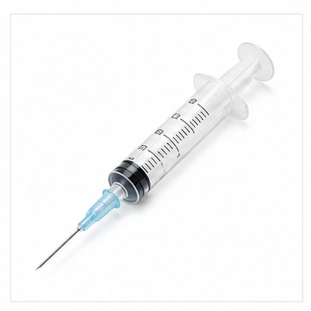
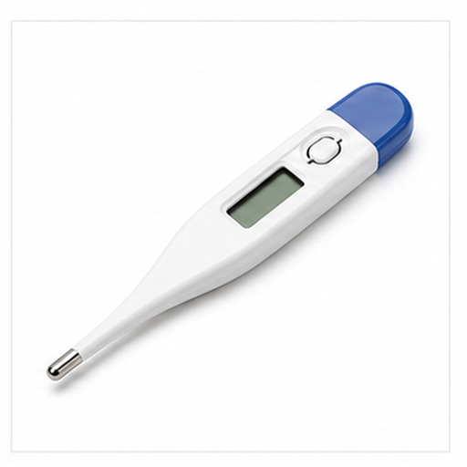
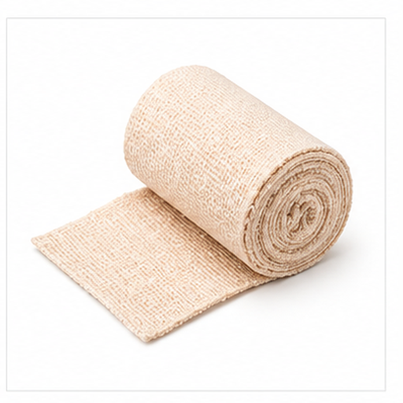
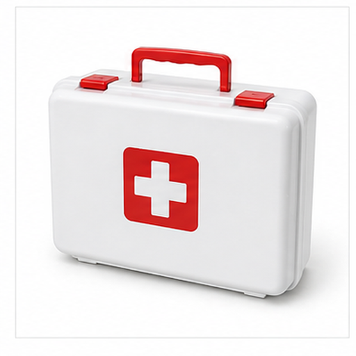
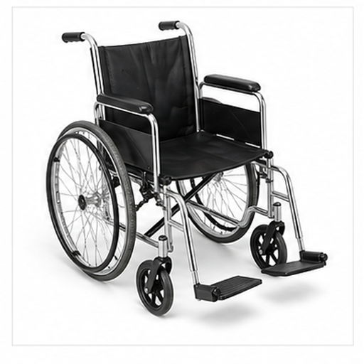
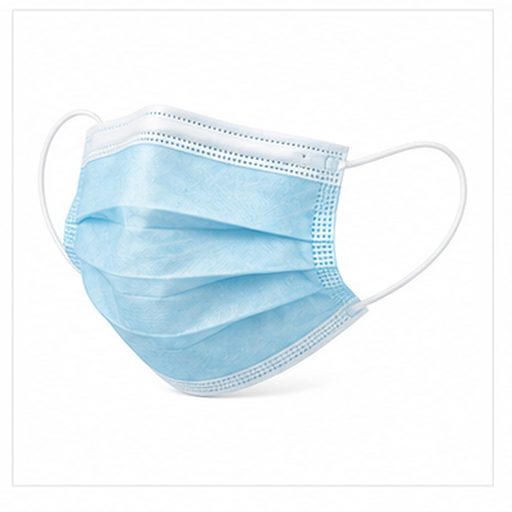
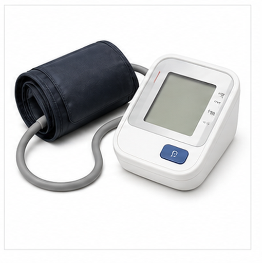
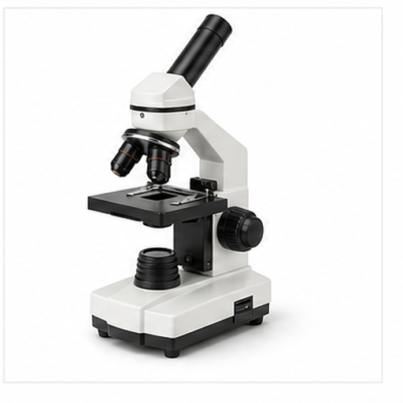

# 多医疗物品图片召回评测

本文档用于增补多模态召回评测的视觉域，覆盖更广泛的物体、材质、场景和用途。

## 听诊器 / Stethoscope

Target: medical.stethoscope

听诊器用于听取心肺声音，是临床检查常用工具。

耳管、软管和圆形听诊头是关键视觉线索。

适合测试医疗器械和软管结构召回。

检索提示：听诊器、Stethoscope、多医疗物品图片召回评测、图片、颜色、形状、材质、局部特征、用途。

## 注射器 / Syringe

Target: medical.syringe

注射器用于抽取或注入液体药物。

透明针筒、活塞和细针头是主要视觉特征。

适合测试细长医疗器具和透明材质召回。

检索提示：注射器、Syringe、多医疗物品图片召回评测、图片、颜色、形状、材质、局部特征、用途。

## 体温计 / Digital Thermometer

Target: medical.thermometer

体温计用于测量人体温度。

细长机身、小屏幕和探头端构成典型外观。

适合测试医疗测量设备和小屏幕召回。

检索提示：体温计、Digital Thermometer、多医疗物品图片召回评测、图片、颜色、形状、材质、局部特征、用途。

## 绷带 / Bandage Roll

Target: medical.bandage

绷带用于包扎伤口或固定受伤部位。

卷状白色织物和层叠边缘是主要视觉线索。

适合测试医疗耗材和卷状纹理召回。

检索提示：绷带、Bandage Roll、多医疗物品图片召回评测、图片、颜色、形状、材质、局部特征、用途。

## 药瓶 / Medicine Bottle

Target: medical.medicine_bottle

药瓶用于存放片剂、胶囊或液体药物。

瓶身、瓶盖和内部药片轮廓是关键线索。

适合测试药品容器和医疗用品召回。

检索提示：药瓶、Medicine Bottle、多医疗物品图片召回评测、图片、颜色、形状、材质、局部特征、用途。

## 急救箱 / First Aid Kit

Target: medical.first_aid_kit

急救箱用于集中存放应急医疗用品。

箱体、提手和医疗十字标识构成典型图像。

适合测试急救物品和箱体结构召回。

检索提示：急救箱、First Aid Kit、多医疗物品图片召回评测、图片、颜色、形状、材质、局部特征、用途。

## 轮椅 / Wheelchair

Target: medical.wheelchair

轮椅帮助行动不便者移动。

大轮、座椅、扶手和脚踏板是主要视觉结构。

适合测试辅助设备和大轮结构召回。

检索提示：轮椅、Wheelchair、多医疗物品图片召回评测、图片、颜色、形状、材质、局部特征、用途。

## 口罩 / Surgical Face Mask

Target: medical.face_mask

口罩用于遮盖口鼻，减少飞沫传播和颗粒吸入。

褶皱面料、耳带和浅色矩形轮廓是主要线索。

适合测试防护用品和柔性材质召回。

检索提示：口罩、Surgical Face Mask、多医疗物品图片召回评测、图片、颜色、形状、材质、局部特征、用途。

## 血压计 / Blood Pressure Monitor

Target: medical.blood_pressure_monitor

血压计用于测量血压，常包含袖带和显示屏。

臂带、软管、主机和数字屏幕是关键视觉线索。

适合测试医疗测量设备和袖带结构召回。

检索提示：血压计、Blood Pressure Monitor、多医疗物品图片召回评测、图片、颜色、形状、材质、局部特征、用途。

## 显微镜 / Microscope

Target: medical.microscope

显微镜用于观察微小样本和细胞结构。

目镜、物镜、载物台和支架是主要视觉结构。

适合测试实验室设备和光学结构召回。

检索提示：显微镜、Microscope、多医疗物品图片召回评测、图片、颜色、形状、材质、局部特征、用途。
