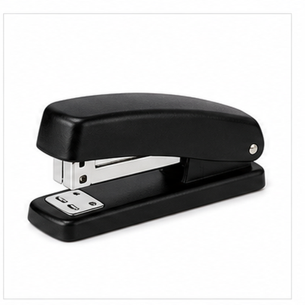
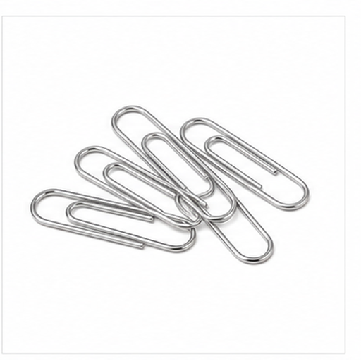

# 多办公用品图片召回评测

本文档用于增补多模态召回评测的视觉域，覆盖更广泛的物体、材质、场景和用途。

## 笔记本 / Notebook

Target: office.notebook

笔记本用于记录会议、学习笔记和日常计划。

封面、纸页和装订边构成主要视觉线索。

适合测试纸质文具和书本形态召回。

检索提示：笔记本、Notebook、多办公用品图片召回评测、图片、颜色、形状、材质、局部特征、用途。

## 钢笔 / Fountain Pen

Target: office.fountain_pen

钢笔用于书写，常具有笔帽和金属笔尖。

细长笔身、笔尖和笔帽是关键视觉特征。

适合测试书写工具和尖端结构召回。

检索提示：钢笔、Fountain Pen、多办公用品图片召回评测、图片、颜色、形状、材质、局部特征、用途。

## 文件夹 / File Folder

Target: office.file_folder

文件夹用于分类保存纸质文件。

扁平封套、标签页和折页结构是主要线索。

适合测试办公收纳用品和扁平形态召回。

检索提示：文件夹、File Folder、多办公用品图片召回评测、图片、颜色、形状、材质、局部特征、用途。

## 订书机 / Stapler

Target: office.stapler

订书机用于把多页纸张装订在一起。

上压臂、底座和金属出钉口是主要视觉结构。

适合测试办公工具和机械结构召回。

检索提示：订书机、Stapler、多办公用品图片召回评测、图片、颜色、形状、材质、局部特征、用途。

## 回形针 / Paper Clips

Target: office.paper_clips

回形针用于临时固定纸张。

细金属线弯成椭圆回环结构是典型视觉线索。

适合测试小型金属文具和重复线条召回。

检索提示：回形针、Paper Clips、多办公用品图片召回评测、图片、颜色、形状、材质、局部特征、用途。

## 计算器 / Calculator

Target: office.calculator

计算器用于数字计算和办公统计。

矩形机身、显示屏和成排按键是关键特征。

适合测试数字工具、按键网格和屏幕召回。

检索提示：计算器、Calculator、多办公用品图片召回评测、图片、颜色、形状、材质、局部特征、用途。

## 白板 / Whiteboard

Target: office.whiteboard

白板用于会议讨论、教学和临时书写。

大面积白色板面、边框和支架构成主要视觉线索。

适合测试办公展示工具和矩形白面召回。

检索提示：白板、Whiteboard、多办公用品图片召回评测、图片、颜色、形状、材质、局部特征、用途。

## 便签 / Sticky Notes

Target: office.sticky_notes

便签用于快速记录提醒和任务。

小方纸片、鲜艳颜色和叠放形态是主要特征。

适合测试彩色纸张和提醒工具召回。

检索提示：便签、Sticky Notes、多办公用品图片召回评测、图片、颜色、形状、材质、局部特征、用途。

## 剪贴板 / Clipboard

Target: office.clipboard

剪贴板用于夹住纸张，方便站立记录。

硬板、顶部金属夹和纸张组合明显。

适合测试夹持文具和板状结构召回。

检索提示：剪贴板、Clipboard、多办公用品图片召回评测、图片、颜色、形状、材质、局部特征、用途。

## 台历 / Desk Calendar

Target: office.desk_calendar

台历用于查看日期和安排日程。

立式支架、翻页纸张和日期页面构成典型外观。

适合测试日程工具和立式纸页召回。

检索提示：台历、Desk Calendar、多办公用品图片召回评测、图片、颜色、形状、材质、局部特征、用途。
