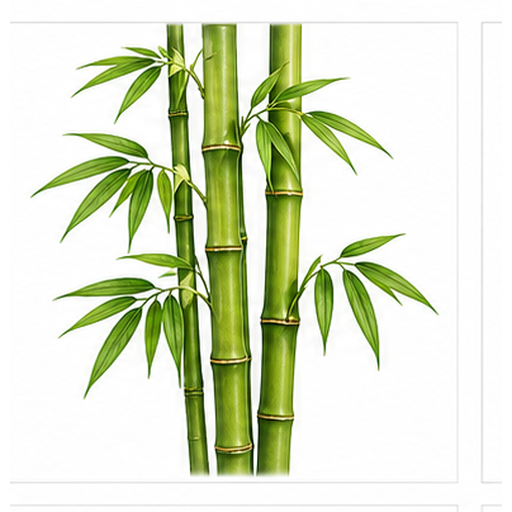
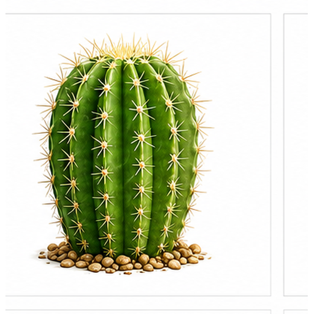
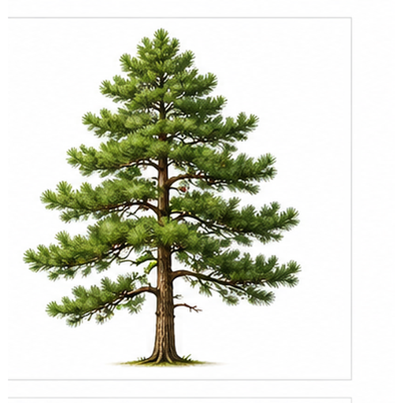
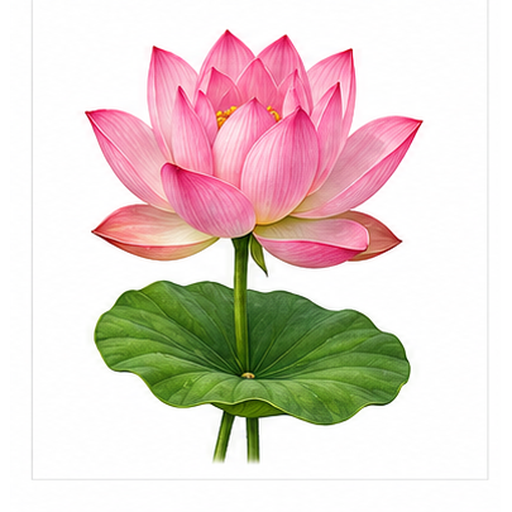
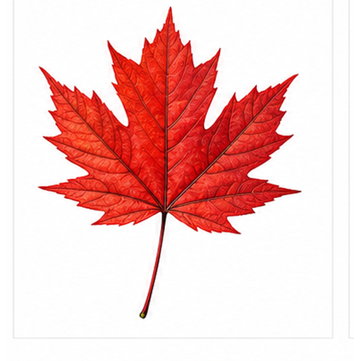
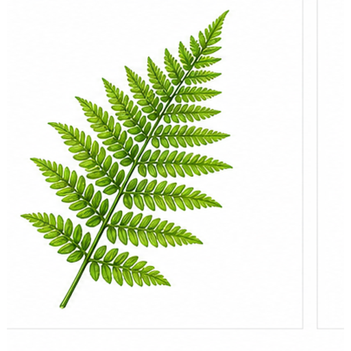

# 多植物图片召回评测

本文档用于评测多模态检索系统能否根据文本查询召回对应图片 asset，以及根据语义问题召回对应文本小节 chunk。

## 玫瑰 / Rose

Target: plants.rose

玫瑰是常见观赏花卉，也常用于礼品和香氛。

层叠红色花瓣、绿色茎和叶片是关键视觉线索。

适合测试红色花朵、花瓣层次和英文 rose 查询召回。

检索提示：玫瑰、Rose、多植物图片召回评测、图片、颜色、形状、局部特征、用途。

## 向日葵 / Sunflower

Target: plants.sunflower

向日葵有向光性，种子可食用或榨油。

黄色放射状花瓣和棕色圆形花盘非常显著。

适合测试黄花瓣、圆形花盘和放射结构召回。

检索提示：向日葵、Sunflower、多植物图片召回评测、图片、颜色、形状、局部特征、用途。

## 竹子 / Bamboo

Target: plants.bamboo

竹子生长迅速，常用于建筑、器具和园林景观。

绿色分节茎秆和细长叶片构成重复结构。

适合测试分节结构、绿色茎秆和中文竹子查询召回。

检索提示：竹子、Bamboo、多植物图片召回评测、图片、颜色、形状、局部特征、用途。

## 仙人掌 / Cactus

Target: plants.cactus

仙人掌适应干旱环境，能在茎中储存水分。

厚实绿色茎、侧枝和刺状结构是典型视觉线索。

适合测试干旱植物、绿色肉质茎和侧枝召回。

检索提示：仙人掌、Cactus、多植物图片召回评测、图片、颜色、形状、局部特征、用途。

## 松树 / Pine Tree

Target: plants.pine_tree

松树是常绿针叶树，常见于山地和寒冷地区。

层叠三角形树冠、针叶和棕色树干构成主要轮廓。

适合测试常绿树、三角形树冠和针叶召回。

检索提示：松树、Pine Tree、多植物图片召回评测、图片、颜色、形状、局部特征、用途。

## 荷花 / Lotus

Target: plants.lotus

荷花生长在水域环境，常与池塘和浮叶一起出现。

粉色花瓣、黄色花心和宽大绿色浮叶是关键线索。

适合测试水生植物、粉色花朵和荷叶召回。

检索提示：荷花、Lotus、多植物图片召回评测、图片、颜色、形状、局部特征、用途。

## 枫树 / Maple

Target: plants.maple

枫树叶片在秋季常呈红色或橙色，观赏价值高。

掌状分裂叶形、红色叶片和尖裂轮廓非常突出。

适合测试红色叶片、掌状叶形和英文 maple 查询召回。

检索提示：枫树、Maple、多植物图片召回评测、图片、颜色、形状、局部特征、用途。

## 郁金香 / Tulip

Target: plants.tulip

郁金香是球根花卉，常见于花园和切花场景。

杯状花冠、直立花茎和宽叶是主要视觉特征。

适合测试杯状花、直立茎和花卉类别召回。

检索提示：郁金香、Tulip、多植物图片召回评测、图片、颜色、形状、局部特征、用途。

## 蕨类 / Fern

Target: plants.fern

蕨类植物通常不以花繁殖，常见于湿润阴凉环境。

羽状复叶沿主轴成对展开，叶片细密。

适合测试叶片重复结构和羽状形态召回。

检索提示：蕨类、Fern、多植物图片召回评测、图片、颜色、形状、局部特征、用途。

## 稻谷 / Rice

Target: plants.rice

稻谷是重要粮食作物，成熟后形成下垂稻穗。

细长茎秆、金黄色谷粒和稻穗结构是主要线索。

适合测试农作物、金色穗状结构和中文稻谷查询召回。

检索提示：稻谷、Rice、多植物图片召回评测、图片、颜色、形状、局部特征、用途。
