# 多图场景对象组合评测

本文档用于评测一个文本小节同时关联多张图片 asset 的多模态召回能力。

## 厨房场景与家电 / Kitchen Scene and Appliances

Target: groups.kitchen_scene_appliances

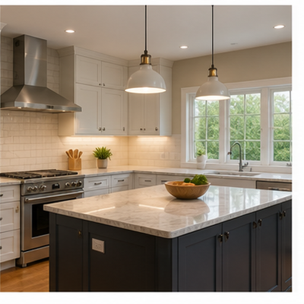

这一组将厨房室内场景和典型厨房电器关联起来。

厨房图像提供空间背景，冰箱、微波炉和电水壶分别对应保存、加热和烧水功能，适合测试场景与对象联合召回。

## 图书馆与学习用品 / Library and Study Objects

Target: groups.library_study_objects

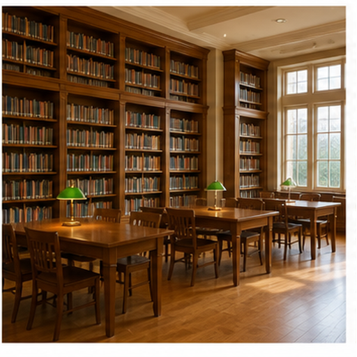

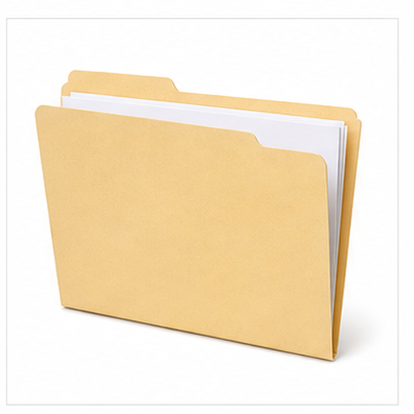

这一组将图书馆室内场景与学习办公用品关联。

图书馆提供阅读空间背景，笔记本、钢笔和文件夹对应记录、书写和资料整理，组合表达学习研究场景。

## 雨天街道与防雨用品 / Rainy Street and Rain Gear

Target: groups.rainy_street_protection

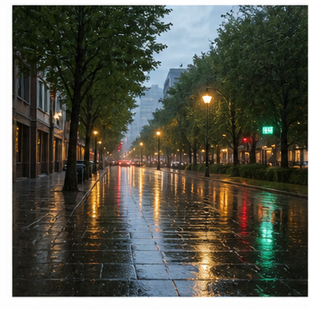

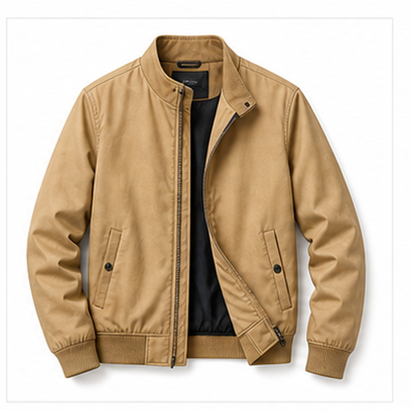

这一组将雨天街道与防雨出行用品关联。

雨天街道表现湿润反光路面，雨伞用于遮雨，夹克提供外层遮挡与保暖，组合语义覆盖天气和出行防护。

## 海滩与夏季物品 / Beach and Summer Items

Target: groups.beach_summer_items

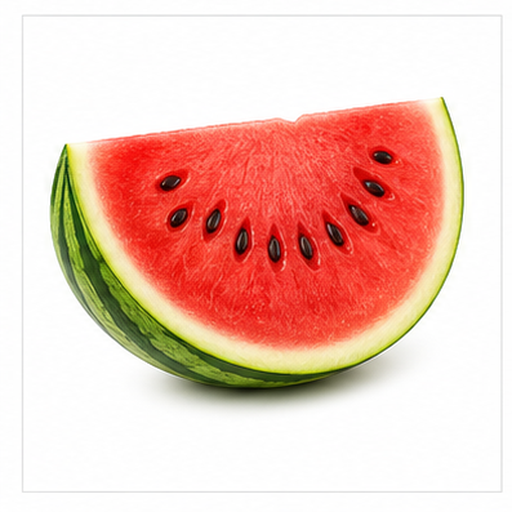

这一组将海滩场景和夏季休闲物品关联。

海滩提供海水和沙地背景，西瓜对应夏季水果，游泳镜用于水中活动，帽子用于遮阳。

## 雪山与保暖穿戴 / Snowy Mountain and Warm Wear

Target: groups.snowy_mountain_wear

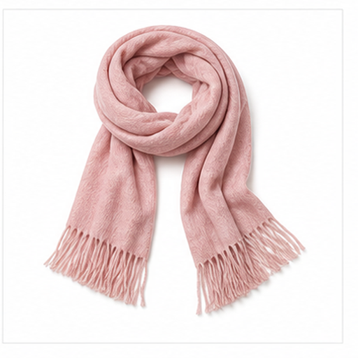

这一组将寒冷自然场景和保暖防护穿戴关联。

雪山强调寒冷和积雪，夹克、围巾和帽子共同表达保暖穿戴。

## 办公会议场景 / Office Meeting Scene

Target: groups.office_meeting_scene

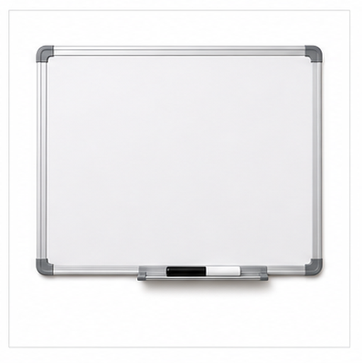

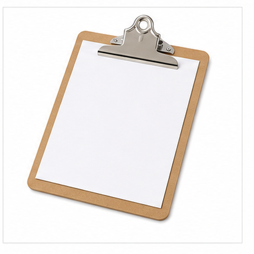

这一组表达会议计划和协作办公场景。

白板用于讨论展示，剪贴板用于记录，台历用于安排日期，笔记本电脑用于演示或在线协作。

## 农田与作物 / Farmland and Crops

Target: groups.farm_crop_scene

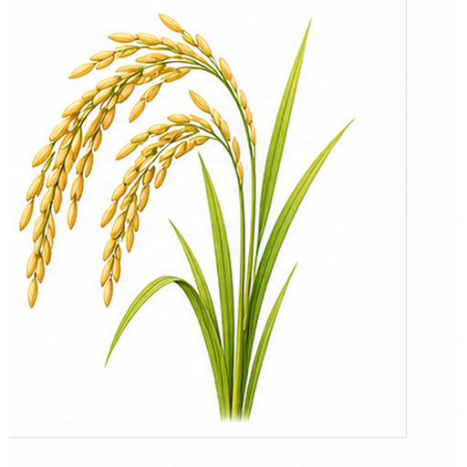

这一组将农业场景和作物图像关联。

农田提供耕作地块和行列背景，稻谷表现粮食作物，向日葵表现观赏和籽用作物。

## 城市夜景与影像设备 / City Night and Media Devices

Target: groups.city_night_media_devices

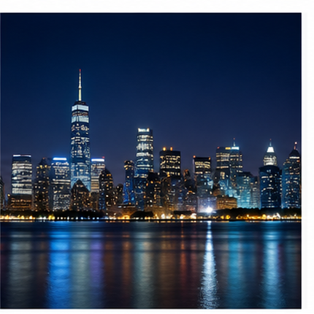

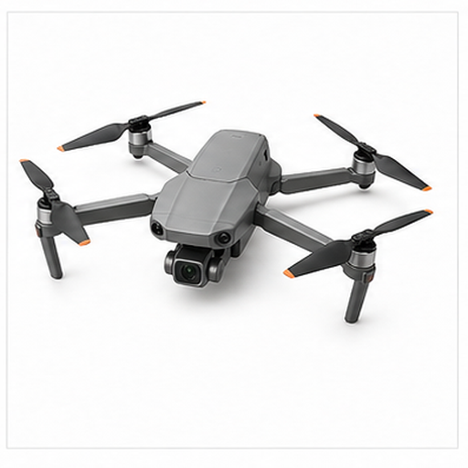

这一组将城市夜景和影像采集设备关联。

城市夜景提供灯光与天际线，相机、手机和无人机分别对应手持拍摄、移动拍摄和航拍视角。

## 沙漠与户外补给 / Desert and Outdoor Supplies

Target: groups.desert_survival_objects

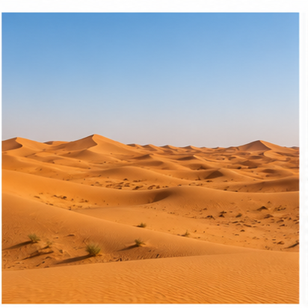

这一组将干旱场景和户外补给物品关联。

沙漠表现干旱和强光，帽子用于遮阳，背包携带物品，急救箱代表户外应急补给。

## 客厅生活场景 / Living Room Scene

Target: groups.living_room_scene

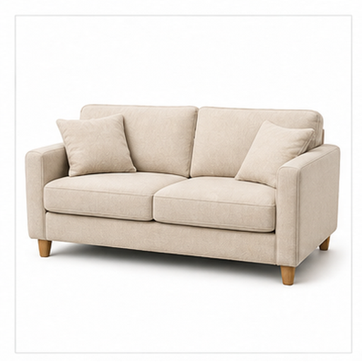

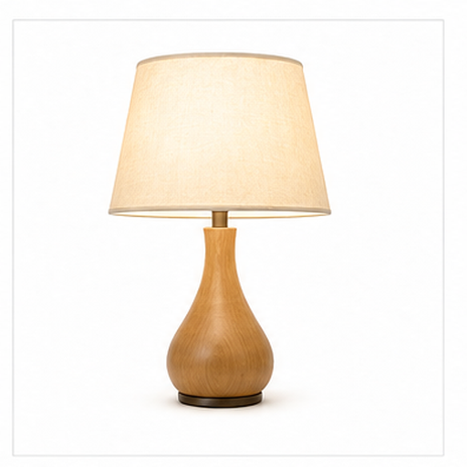

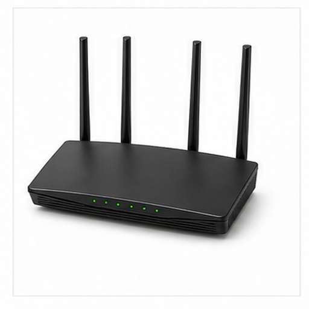

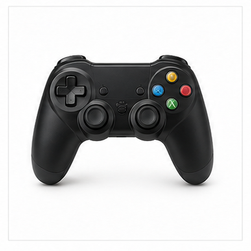

这一组表达客厅中的休息、照明、网络和娱乐对象。

沙发提供休息座位，台灯提供局部照明，路由器提供网络连接，游戏手柄提供娱乐控制。
