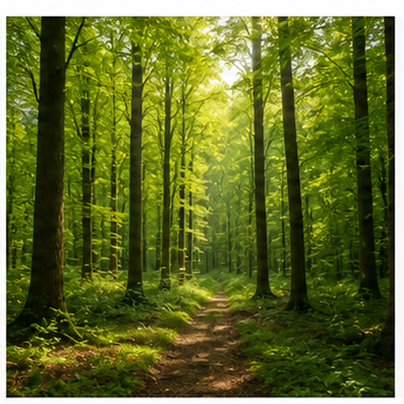
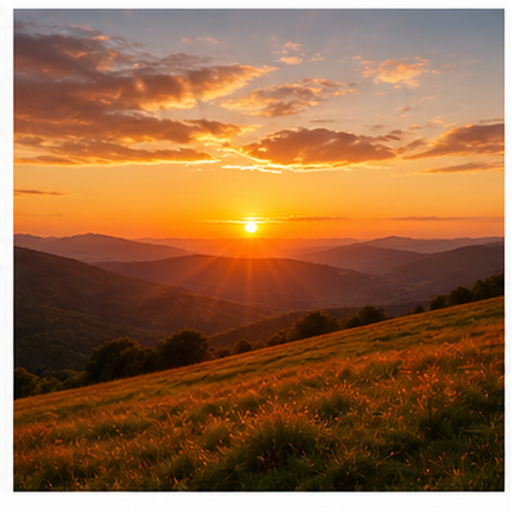

# 多场景天气图片召回评测

本文档用于增补多模态召回评测的视觉域，覆盖更广泛的物体、材质、场景和用途。

## 海滩 / Beach

Target: scenes.beach

海滩场景常包含海水、沙滩和开阔天空。

蓝色海面、浅色沙地和水平海岸线是主要视觉线索。

适合测试自然场景、水体和沙地召回。

检索提示：海滩、Beach、多场景天气图片召回评测、图片、颜色、形状、材质、局部特征、用途。

## 雪山 / Snowy Mountain

Target: scenes.snowy_mountain

雪山场景表现高海拔山体和寒冷环境。

白色积雪、尖峰山体和蓝天背景是关键特征。

适合测试雪景、山体轮廓和冷色自然场景召回。

检索提示：雪山、Snowy Mountain、多场景天气图片召回评测、图片、颜色、形状、材质、局部特征、用途。

## 森林 / Forest

Target: scenes.forest

森林由密集树木、树冠和阴影环境组成。

绿色树冠、竖直树干和层叠植被是主要线索。

适合测试自然植被场景和深绿色纹理召回。

检索提示：森林、Forest、多场景天气图片召回评测、图片、颜色、形状、材质、局部特征、用途。

## 沙漠 / Desert

Target: scenes.desert

沙漠场景以干旱气候和大片沙地为特征。

黄色沙丘、开阔天空和稀少植被构成典型图像。

适合测试干旱场景、沙丘纹理和暖色地貌召回。

检索提示：沙漠、Desert、多场景天气图片召回评测、图片、颜色、形状、材质、局部特征、用途。

## 城市夜景 / City Night Skyline

Target: scenes.city_night

城市夜景展示建筑轮廓、灯光和夜间天际线。

高楼剪影、窗户灯光和深色天空是关键视觉线索。

适合测试人工场景、夜间光源和建筑轮廓召回。

检索提示：城市夜景、City Night Skyline、多场景天气图片召回评测、图片、颜色、形状、材质、局部特征、用途。

## 雨天街道 / Rainy Street

Target: scenes.rainy_street

雨天街道表现湿润路面、降雨和反光环境。

雨滴、湿地反光、街灯和道路透视是主要特征。

适合测试天气场景、反射和街道语义召回。

检索提示：雨天街道、Rainy Street、多场景天气图片召回评测、图片、颜色、形状、材质、局部特征、用途。

## 日落 / Sunset Landscape

Target: scenes.sunset

日落场景表现太阳接近地平线时的暖色天空。

橙红天空、低位太阳和地平线剪影是主要线索。

适合测试自然光照、暖色渐变和时间语义召回。

检索提示：日落、Sunset Landscape、多场景天气图片召回评测、图片、颜色、形状、材质、局部特征、用途。

## 农田 / Farmland

Target: scenes.farmland

农田场景包含耕作地块、作物行列和开阔乡村空间。

整齐田垄、绿色或金色作物和远处地平线是关键特征。

适合测试农业场景、行列纹理和乡村地貌召回。

检索提示：农田、Farmland、多场景天气图片召回评测、图片、颜色、形状、材质、局部特征、用途。

## 图书馆 / Library Interior

Target: scenes.library

图书馆室内场景包含书架、书本和安静阅读空间。

成排书架、书脊纹理和室内透视是主要视觉线索。

适合测试室内公共空间和重复书本结构召回。

检索提示：图书馆、Library Interior、多场景天气图片召回评测、图片、颜色、形状、材质、局部特征、用途。

## 厨房 / Kitchen Interior

Target: scenes.kitchen

厨房室内场景包含橱柜、台面和烹饪设备。

操作台、橱柜、水槽或灶具形成典型厨房结构。

适合测试室内生活场景和厨房设施召回。

检索提示：厨房、Kitchen Interior、多场景天气图片召回评测、图片、颜色、形状、材质、局部特征、用途。
