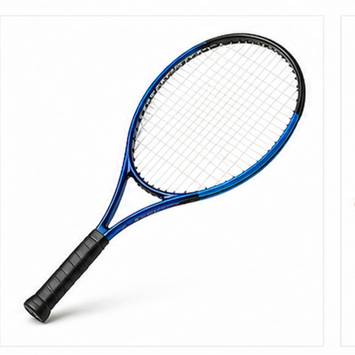
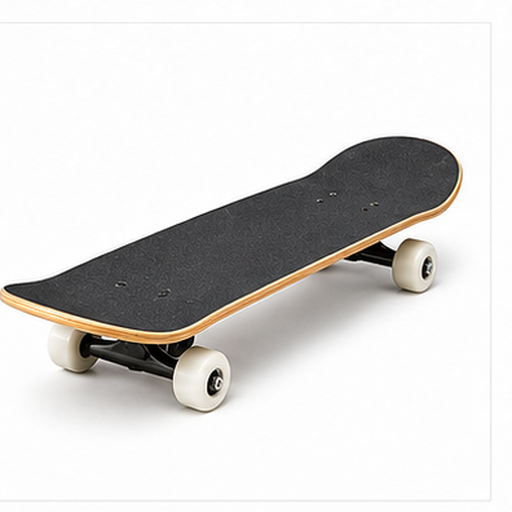
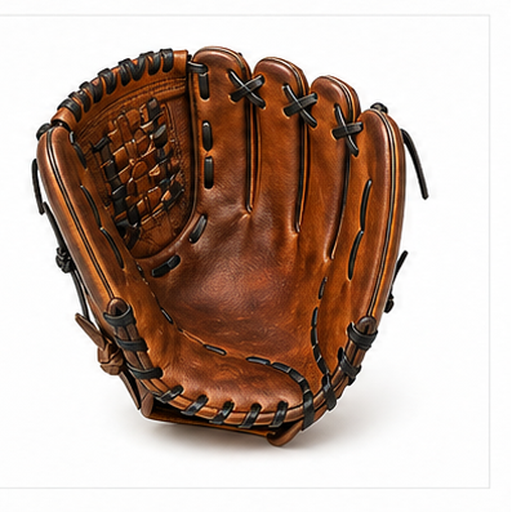

# 多运动器材图片召回评测

本文档用于增补多模态召回评测的视觉域，覆盖更广泛的物体、材质、场景和用途。

## 足球 / Soccer Ball

Target: sports.soccer_ball

足球用于足球运动中的传球、射门和控球。

黑白拼块或多边形纹理的球体是主要线索。

适合测试球类、几何纹理和运动语义召回。

检索提示：足球、Soccer Ball、多运动器材图片召回评测、图片、颜色、形状、材质、局部特征、用途。

## 篮球 / Basketball

Target: sports.basketball

篮球用于投篮、运球和团队比赛。

橙色球体、黑色弧线和颗粒纹理是关键特征。

适合测试橙色球类和线条纹理召回。

检索提示：篮球、Basketball、多运动器材图片召回评测、图片、颜色、形状、材质、局部特征、用途。

## 网球拍 / Tennis Racket

Target: sports.tennis_racket

网球拍用于击打网球，包含拍面和握柄。

椭圆拍框、网线和长握柄是主要视觉线索。

适合测试球拍结构和网格纹理召回。

检索提示：网球拍、Tennis Racket、多运动器材图片召回评测、图片、颜色、形状、材质、局部特征、用途。

## 滑板 / Skateboard

Target: sports.skateboard

滑板用于街头运动和短距离滑行。

长板面、四个小轮和弯曲板头是典型外观。

适合测试板类运动器材和轮子召回。

检索提示：滑板、Skateboard、多运动器材图片召回评测、图片、颜色、形状、材质、局部特征、用途。

## 哑铃 / Dumbbell

Target: sports.dumbbell

哑铃用于力量训练和健身锻炼。

中间握柄和两端配重块构成对称结构。

适合测试健身器材和金属对称结构召回。

检索提示：哑铃、Dumbbell、多运动器材图片召回评测、图片、颜色、形状、材质、局部特征、用途。

## 瑜伽垫 / Yoga Mat

Target: sports.yoga_mat

瑜伽垫用于瑜伽、拉伸和地面训练。

卷起或展开的长方形软垫是主要视觉线索。

适合测试柔性运动垫和卷状结构召回。

检索提示：瑜伽垫、Yoga Mat、多运动器材图片召回评测、图片、颜色、形状、材质、局部特征、用途。

## 拳击手套 / Boxing Gloves

Target: sports.boxing_gloves

拳击手套用于保护手部并缓冲击打。

成对厚手套、腕带和红色软垫轮廓常见。

适合测试成对器材和防护垫结构召回。

检索提示：拳击手套、Boxing Gloves、多运动器材图片召回评测、图片、颜色、形状、材质、局部特征、用途。

## 游泳镜 / Swimming Goggles

Target: sports.swimming_goggles

游泳镜用于保护眼睛并改善水下视野。

两个透明镜片、鼻桥和弹性带是关键线索。

适合测试透明镜片和水上运动配件召回。

检索提示：游泳镜、Swimming Goggles、多运动器材图片召回评测、图片、颜色、形状、材质、局部特征、用途。

## 棒球手套 / Baseball Glove

Target: sports.baseball_glove

棒球手套用于接球和保护手掌。

棕色皮革、张开的手掌形状和缝线是主要特征。

适合测试皮革纹理和手套形态召回。

检索提示：棒球手套、Baseball Glove、多运动器材图片召回评测、图片、颜色、形状、材质、局部特征、用途。

## 自行车头盔 / Bicycle Helmet

Target: sports.bicycle_helmet

自行车头盔用于骑行时保护头部。

弧形外壳、通风孔和安全带结构是典型线索。

适合测试防护装备和通风孔召回。

检索提示：自行车头盔、Bicycle Helmet、多运动器材图片召回评测、图片、颜色、形状、材质、局部特征、用途。
