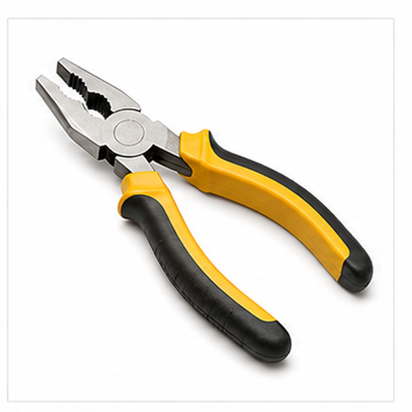
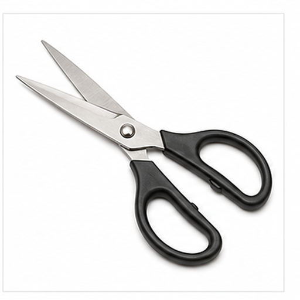
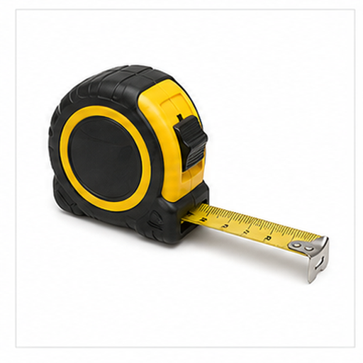
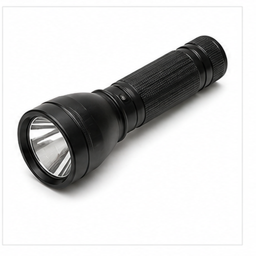

# 多工具图片召回评测

本文档用于评测多模态检索系统能否根据文本查询召回对应图片 asset，以及根据语义问题召回对应文本小节 chunk。

## 锤子 / Hammer

Target: tools.hammer

锤子用于敲击钉子、调整部件或进行简单拆装。

金属锤头和长柄构成清晰的 T 形或 L 形轮廓。

适合测试手工具、金属头部和木柄召回。

检索提示：锤子、Hammer、多工具图片召回评测、图片、颜色、形状、局部特征、用途。

## 扳手 / Wrench

Target: tools.wrench

扳手用于拧动螺母和螺栓，是维修场景常见工具。

开口夹持端、金属柄和弧形头部是主要视觉线索。

适合测试金属工具、开口钳口和英文 wrench 查询召回。

检索提示：扳手、Wrench、多工具图片召回评测、图片、颜色、形状、局部特征、用途。

## 螺丝刀 / Screwdriver

Target: tools.screwdriver

螺丝刀用于拧紧或拆卸螺丝，常见于装配和维修。

手柄、长金属杆和尖端构成细长轮廓。

适合测试尖端工具、红色手柄和螺丝相关语义召回。

检索提示：螺丝刀、Screwdriver、多工具图片召回评测、图片、颜色、形状、局部特征、用途。

## 钳子 / Pliers

Target: tools.pliers

钳子可用于夹紧、弯折或剪切小型材料。

两个手柄、铰接点和夹持钳口是关键结构。

适合测试双手柄、铰链和夹持工具召回。

检索提示：钳子、Pliers、多工具图片召回评测、图片、颜色、形状、局部特征、用途。

## 剪刀 / Scissors

Target: tools.scissors

剪刀用于裁剪纸张、布料或其他薄材料。

两个圆形握环和交叉刀刃构成典型图像。

适合测试交叉结构、握环和刀刃召回。

检索提示：剪刀、Scissors、多工具图片召回评测、图片、颜色、形状、局部特征、用途。

## 卷尺 / Tape Measure

Target: tools.tape_measure

卷尺用于测量长度，外壳中收纳可伸缩尺带。

黄色外壳和伸出的金属尺带是主要线索。

适合测试测量工具、黄色壳体和尺带召回。

检索提示：卷尺、Tape Measure、多工具图片召回评测、图片、颜色、形状、局部特征、用途。

## 电钻 / Drill

Target: tools.drill

电钻是电动工具，用于钻孔或安装螺丝。

机身、手柄、扳机区域和钻头形成明显工具轮廓。

适合测试电动工具、钻头和蓝色机身召回。

检索提示：电钻、Drill、多工具图片召回评测、图片、颜色、形状、局部特征、用途。

## 刷子 / Brush

Target: tools.brush

刷子用于涂刷、清洁或表面处理。

刷毛、金属箍和长柄是最重要的视觉结构。

适合测试刷毛细节和手柄工具召回。

检索提示：刷子、Brush、多工具图片召回评测、图片、颜色、形状、局部特征、用途。

## 铲子 / Shovel

Target: tools.shovel

铲子用于挖掘、搬运土壤或清理材料。

长柄和宽铲头形成明显的纵向工具轮廓。

适合测试园艺工具、宽铲头和长柄召回。

检索提示：铲子、Shovel、多工具图片召回评测、图片、颜色、形状、局部特征、用途。

## 手电筒 / Flashlight

Target: tools.flashlight

手电筒用于照明，常在夜间或低光环境使用。

筒身、发光端和光束方向构成关键视觉线索。

适合测试照明工具和光束语义召回。

检索提示：手电筒、Flashlight、多工具图片召回评测、图片、颜色、形状、局部特征、用途。
