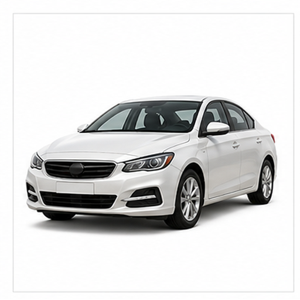
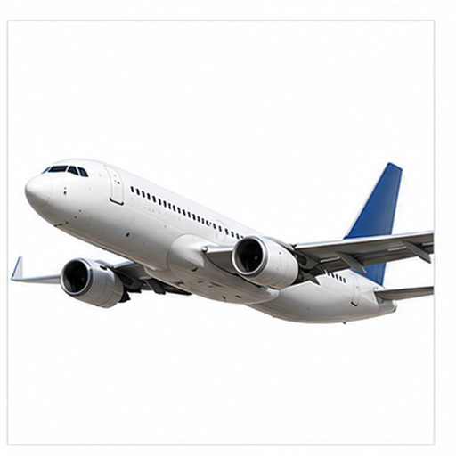
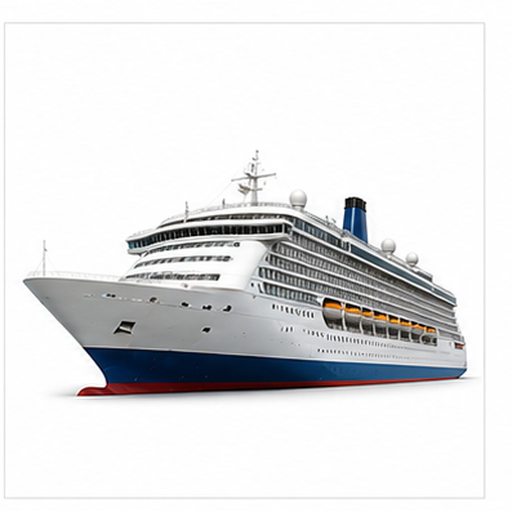
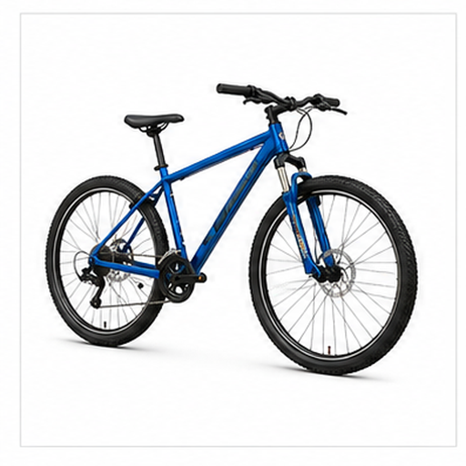
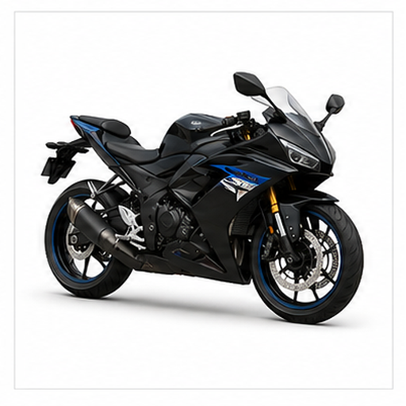
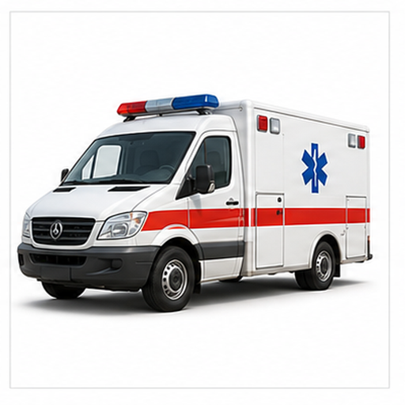
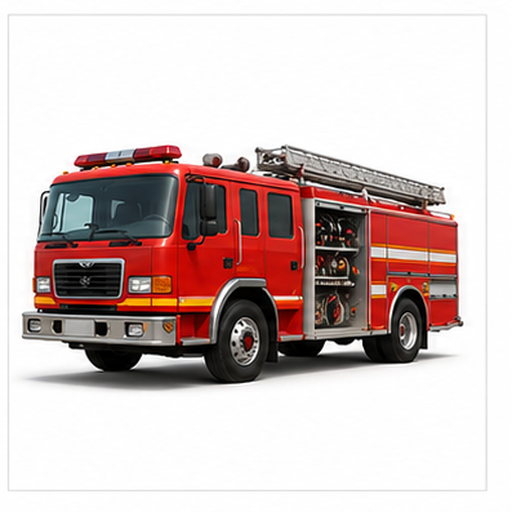

# 多交通工具图片召回评测

本文档用于评测多模态检索系统能否根据文本查询召回对应图片 asset，以及根据语义问题召回对应文本小节 chunk。

## 汽车 / Car

Target: vehicles.car

汽车是道路上常见的私人交通工具，适合短途和城市出行。

车身、车窗、车灯和四个车轮构成基本视觉结构。

适合测试蓝色车身、车轮和英文 car 查询召回。

检索提示：汽车、Car、多交通工具图片召回评测、图片、颜色、形状、局部特征、用途。

## 公交车 / Bus

Target: vehicles.bus

公交车用于城市公共交通，能搭载较多乘客。

长车身、成排车窗、较高车厢和醒目颜色是主要线索。

适合测试大型车辆、公共交通和黄色车身召回。

检索提示：公交车、Bus、多交通工具图片召回评测、图片、颜色、形状、局部特征、用途。

## 火车 / Train

Target: vehicles.train

火车沿轨道运行，可承担城市通勤和长途运输。

车头、车厢、轨道和横向延展结构是图像重点。

适合测试轨道交通、蓝色车体和车厢结构召回。

检索提示：火车、Train、多交通工具图片召回评测、图片、颜色、形状、局部特征、用途。

## 飞机 / Airplane

Target: vehicles.airplane

飞机用于空中交通，适合远距离高速旅行。

细长机身、机翼、尾翼和流线型轮廓是关键视觉线索。

适合测试空中交通、机翼和英文 airplane 查询召回。

检索提示：飞机、Airplane、多交通工具图片召回评测、图片、颜色、形状、局部特征、用途。

## 轮船 / Ship

Target: vehicles.ship

轮船在水面航行，用于客运、货运或海上作业。

船体、甲板、烟囱和水上轮廓有助于识别。

适合测试水上交通工具和船体结构召回。

检索提示：轮船、Ship、多交通工具图片召回评测、图片、颜色、形状、局部特征、用途。

## 自行车 / Bicycle

Target: vehicles.bicycle

自行车依靠人力驱动，是轻便的个人交通工具。

两个大轮、车架、车把和细长结构是核心视觉线索。

适合测试双轮、车架和人力交通概念召回。

检索提示：自行车、Bicycle、多交通工具图片召回评测、图片、颜色、形状、局部特征、用途。

## 摩托车 / Motorcycle

Target: vehicles.motorcycle

摩托车以发动机驱动，比自行车速度更快、结构更厚重。

两个车轮、车把、车座和发动机区域是主要线索。

适合测试机动双轮交通工具召回。

检索提示：摩托车、Motorcycle、多交通工具图片召回评测、图片、颜色、形状、局部特征、用途。

## 救护车 / Ambulance

Target: vehicles.ambulance

救护车用于急救运输，常配有医疗标识和警示灯。

白色车身、红色医疗十字和厢式车体是典型视觉特征。

适合测试应急车辆和红十字标识召回。

检索提示：救护车、Ambulance、多交通工具图片召回评测、图片、颜色、形状、局部特征、用途。

## 消防车 / Fire Truck

Target: vehicles.fire_truck

消防车用于火灾救援和应急处置，通常携带梯子和设备。

红色大型车身、梯子和多个车轮是主要视觉线索。

适合测试红色救援车辆和梯子结构召回。

检索提示：消防车、Fire Truck、多交通工具图片召回评测、图片、颜色、形状、局部特征、用途。

## 地铁 / Subway

Target: vehicles.subway

地铁列车服务城市轨道交通，通常在地下或高架线路运行。

正面车窗、车灯、轨道和列车头部构成识别重点。

适合测试城市轨道交通和列车正面召回。

检索提示：地铁、Subway、多交通工具图片召回评测、图片、颜色、形状、局部特征、用途。
