# 多图视觉对比评测

本文档用于评测一个文本小节同时关联多张图片 asset 的多模态召回能力。

## 柑橘色水果对比 / Citrus Color Comparison

Target: groups.citrus_comparison

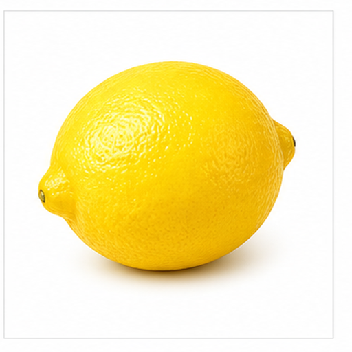

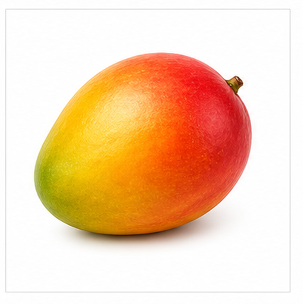

这一组比较橙色或黄色水果的相近外观。

橙子偏圆且表皮橙色，柠檬更偏椭圆并带尖端，芒果通常呈黄橙色椭圆并可能带红绿色过渡。

## 宠物面部对比 / Pet Face Comparison

Target: groups.pet_face_comparison

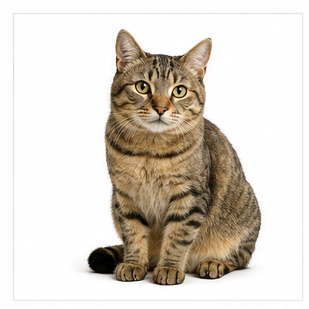

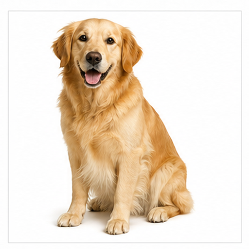

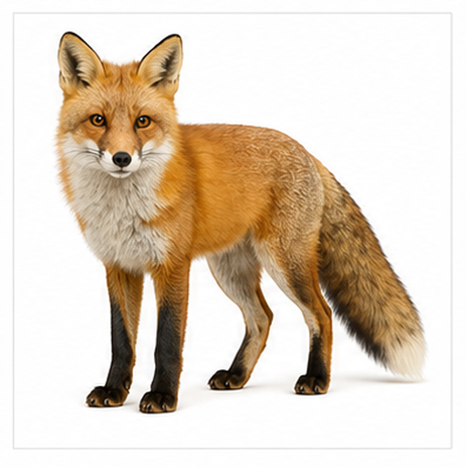

这一组比较常见犬猫类动物的面部线索。

猫突出三角耳和胡须，狗常见下垂耳和短吻部，狐狸以橙红毛色、尖耳和白色面部区域区分。

## 城市交通工具对比 / Urban Transit Comparison

Target: groups.urban_transit_comparison

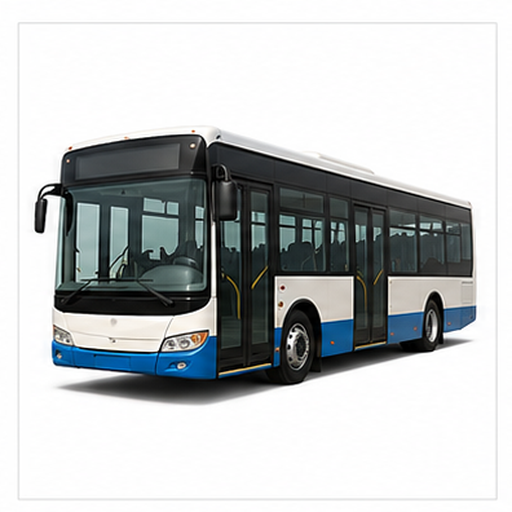

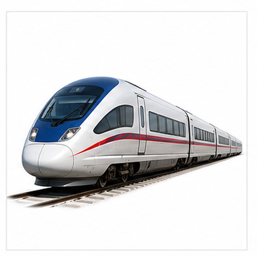

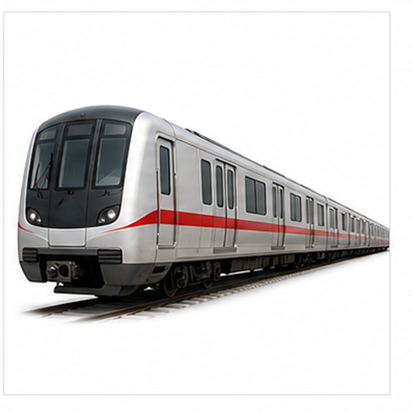

这一组比较城市公共交通和轨道交通图像。

公交车有长车身和成排车窗，火车强调车厢与轨道延展，地铁更突出城市轨道列车的正面和轨道环境。

## 圆形运动球对比 / Round Sports Ball Comparison

Target: groups.round_sports_balls

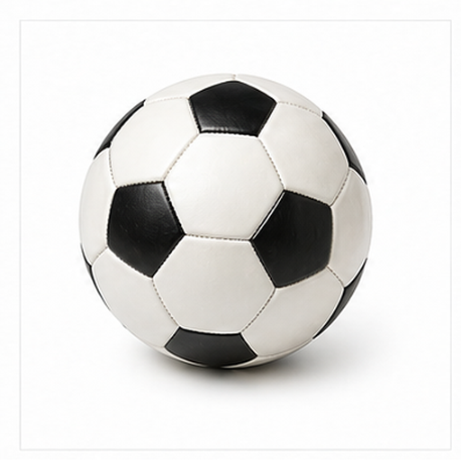

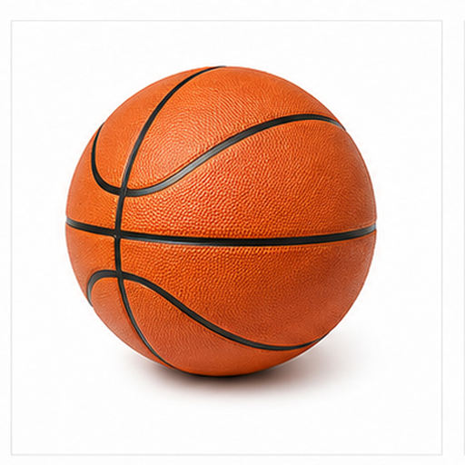

这一组用圆形或颗粒视觉元素构造细粒度区分。

足球和篮球都是球体，但足球有拼块纹理，篮球有橙色表面和黑色弧线；米饭则是碗中小颗粒聚集，并非运动球。

## 键盘与输入设备对比 / Keyboard and Input Device Comparison

Target: groups.keyboard_input_devices

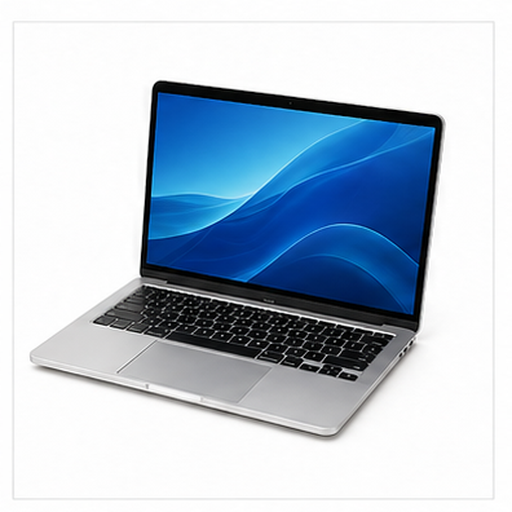

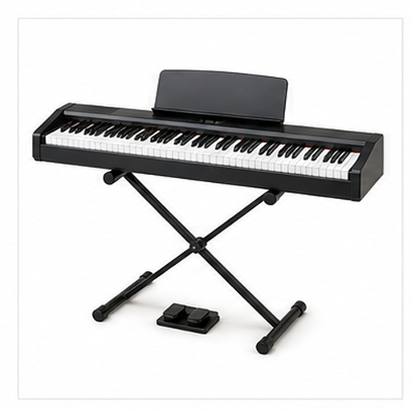

这一组比较具有重复按键结构的对象。

笔记本电脑结合屏幕和键盘，计算器有数字按键和小屏幕，钢琴键盘以黑白琴键形成长条重复结构。

## 防护用品对比 / Protective Item Comparison

Target: groups.protective_items_comparison

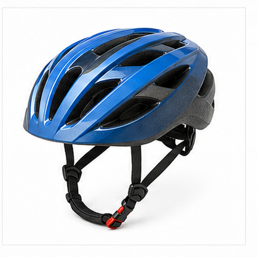

这一组比较不同防护用品的形态。

口罩覆盖口鼻并带耳带，自行车头盔覆盖头部并有通风孔，雨伞通过展开伞面遮挡雨水或阳光。

## 长柄手持工具对比 / Long Handheld Tool Comparison

Target: groups.long_handheld_tools

这一组比较长柄或细长手持工具。

锤子由锤头和柄组成，螺丝刀有手柄和金属杆，铲子则由长柄和宽铲头形成更长的纵向轮廓。

## 花卉形态对比 / Flower Shape Comparison

Target: groups.flower_shape_comparison

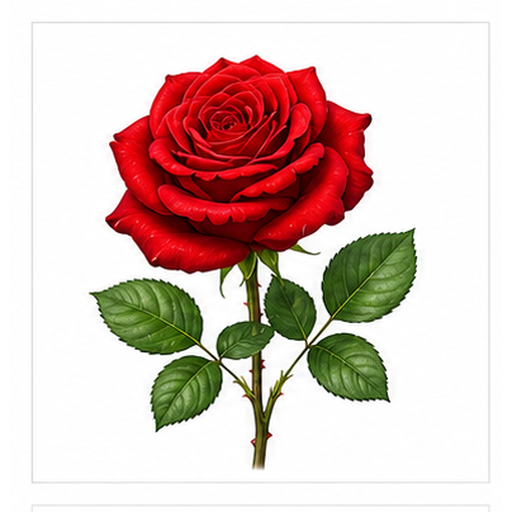

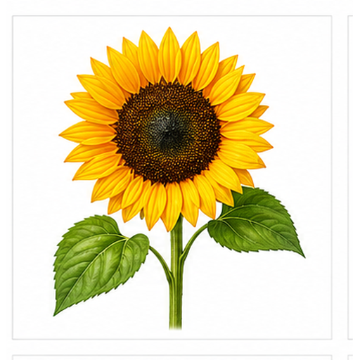

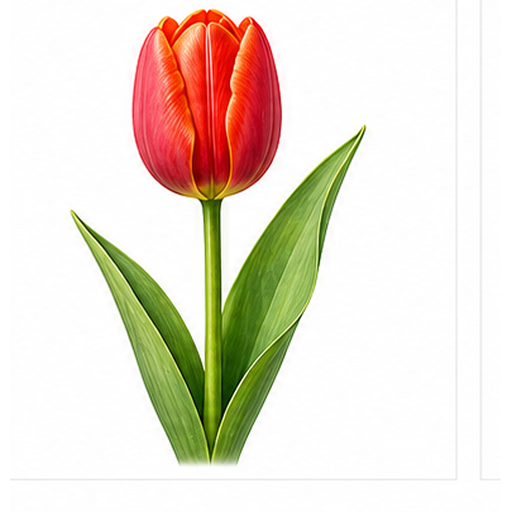

这一组比较三种花卉的花冠形态。

玫瑰有层叠花瓣，向日葵具有放射状黄色花瓣和圆形花盘，郁金香的杯状花冠和直立花茎更明显。

## 弦乐器外观对比 / String Instrument Comparison

Target: groups.string_instrument_comparison

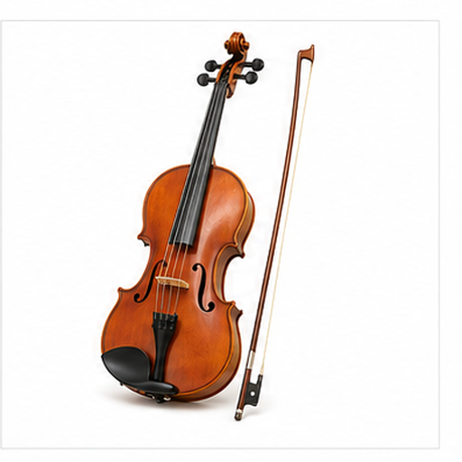

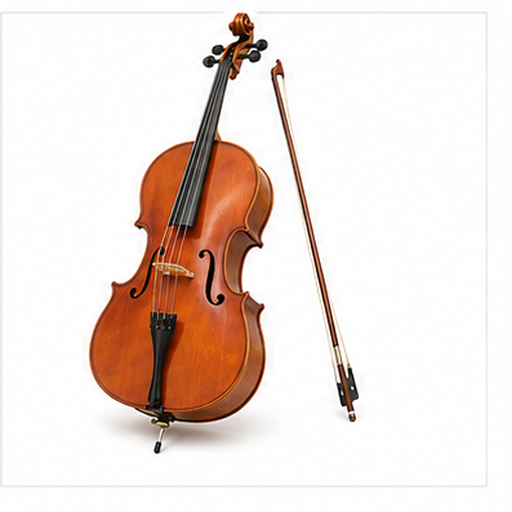

这一组比较弦乐器的尺寸与结构。

吉他有共鸣箱和音孔，小提琴较小并常与琴弓配合，大提琴更大且竖直演奏，三者都以琴弦和木质琴身为核心。

## 地标建筑轮廓对比 / Famous Architecture Shape Comparison

Target: groups.famous_architecture_shapes

这一组比较地标建筑的几何轮廓。

埃菲尔铁塔是高耸金属桁架，金字塔是沙色三角体，悉尼歌剧院以白色帆形屋顶形成现代轮廓。
